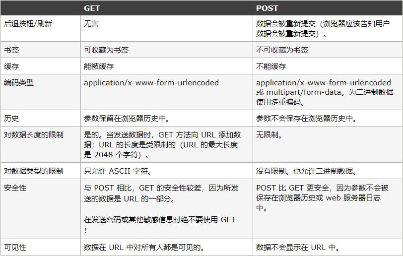

Ajax基本用法
===================
AJAX 是为了实现无刷新、无提交的情况下，对页面内容进行局部更新。
通过`XMLHttpRequest`对象能向服务器发起异步请求，这是一个各大浏览器创建时底层都已写好的一个对象。通过它就可以在客户端向服务器发起异步请求，说到底其实就是js通过XmlHttpRequest对象来向服务器发异步请求，从服务器获得数据，然后操作DOM而更新页面。而不是传统意义上的表单提交或者URL后加问号键值对跳转。

###XMLHttpRequest对象
XMLHttpRequest 用于在后台与服务器交换数据。
语法：

    var myajax=new XMLHttpRequest();

老版本的 Internet Explorer （IE5 和 IE6）使用 ActiveX 对象：

    var myajax=new ActiveXObject("Microsoft.XMLHTTP"); 如果考虑兼容性，就可以写成：

    if (window.XMLHttpRequest)
      {
      // code for IE7+, Firefox, Chrome, Opera, Safari
      var myajax=new XMLHttpRequest();
      }
    else
      {
      // code for IE6, IE5
      var  myajax=new ActiveXObject("Microsoft.XMLHTTP");
      }

###XMLHttpRequest对象的属性
1.**readyState**属性
表示XHR的当前响应状态，即请求-响应过程进行到了哪一步。取值有5个：
0—(默认值)UNSENT，请求消息尚未发出；
1—OPENED，XHR和服务器之间的连接已打开；
2—HEADERS_RECEIVED，XHR已经接收到了响应消息的头部，也就意味着既然响应头已经接收到了，响应起始行也早就接收完毕。
3—LOADING，XHR正在加载响应主体，在这个状态下的响应主体是不断加载的，并未加载完成。
4—DONE，XHR接收完毕响应消息。
这是XHR至关重要的一个属性，它的值只能依次递增，不能跳着加，也不能后退。它根据响应过程的变化，自动改变值，不允许手动赋值。通过它可以知道请求消息是否成功发出。

2.**status**属性
从服务器返回的响应状态码，默认值为0，比如常见的200（已就绪）和404（未找到）。
**statusText**属性
伴随状态码的字符串信息，当状态为 200 的时候它是 “OK”，当状态为 404 的时候它是 “Not Found”。

3.**responseType**
设置返回数据的类型。
1. ""	将 responseType 设为空字符串与设置为"text"相同， 是默认类型 （实际上是 DOMString）。
2. "arraybuffer"	response 是一个包含二进制数据的 JavaScript ArrayBuffer 。
3. "blob"	response 是一个包含二进制数据的 Blob 对象 。
4. "document"	response 是一个 HTML Document 或 XML XMLDocument ，这取决于接收到的数据的 MIME 类型。请参阅 HTML in XMLHttpRequest 以了解使用 XHR 获取 HTML 内容的更多信息。
5. "json"	response 是一个 JavaScript 对象。这个对象是通过将接收到的数据类型视为 JSON 解析得到的。

4.**response**(**responseText** 或 **responseXML** )
获得来自服务器的响应返回内容response,可能为 ArrayBuffer、Blob、Document，或 DOMString，取决于 responseType。
responseText获得从服务器进程返回数据的字符串形式。
responseXML获得从服务器进程返回的DOM兼容的文档数据对象。

5.**timeout**
表示该请求的最大请求时间（毫秒），若超出该时间，则请求会自动结束。

###XMLHttpRequest对象的方法
将请求发送到服务器，需要使用 XMLHttpRequest 对象的 open() 和 send() 方法：
**1.open(method,url,async)**
建立对服务器的请求。
`method`：请求的类型；"GET" 或 "POST"。与 POST 相比，GET 更简单也更快，并且在大部分情况下都能用。
但是，以下情况：
  1.无法使用缓存文件（更新服务器上的文件或数据库）
  2.向服务器发送大量数据（POST 没有数据量限制）
  3.发送包含未知字符的用户输入时，POST 比 GET 更稳定也更可靠
`url`：文件在服务器上的位置
`async`：true（异步）或 false（同步）
与 POST 相比，GET 更简单也更快，并且在大部分情况下都能用。
**2.send(content)**
将请求，数据（POST）发送到服务器。
**3.setRequestHeader("header","value")**
在调用open方法之后，提供头部需要的值。

### 事件
**onreadystatechange**

当请求被发送到服务器时，我们需要执行一些基于响应的任务。
readyState属性存有 XMLHttpRequest 的状态信息，每当 readyState 改变时，就会触发 onreadystatechange 事件。

**进度事件**
`progress`，`load`，`error`，`abort`

progress 事件同时存在于下载和上传的传输。
一个完整的ajax请求都会从loadstart事件开始，然后不间断地触发progress事件，然后触发load、abort、timeout或者error事件中的一个，最后触发loadend事件。
注意：只要浏览器接收到了服务器的响应，不管其状态如何都会触发load事件。

###发起异步请求的步骤
1.新建XMLHttpRequest对象
2.建立onreadystatechange存储的函数
3.发送请求

    <!DOCTYPE html>
    <html lang="en">
    <head>
	<meta charset="UTF-8">
	<title>ajax</title>
    </head>
    <body>
	<input type="button" name="" id="btn" value="ajax测试">
	

	
    </body>
    </html>

###GET和POST
**GET**
常用于向服务器查询某些信息。必要时，可以将查询字符串参数(必须ASCII字符)追加到 URL 的末尾，将信息发送给服务器。

    ajax.open("GET", "example.php?name1=value1&name2=value2", true);
get请求的过程： 
（1）浏览器请求tcp连接（第一次握手） 
（2）服务器答应进行tcp连接（第二次握手） 
（3）浏览器确认，并发送get请求头和数据（第三次握手，这个报文比较小，所以http会在此时进行第一次数据发送） 
（4）服务器返回200 OK响应 

**POST**
常用于向服务器发送应该被保存的数据，把数据作为请求的主体提交。POST 请求的主体可以包含非常多的数据，而且格式不限，向 send()方法中传入数据。

    xhr.open("POST", "example.php", true);
post请求的过程： 
（1）浏览器请求tcp连接（第一次握手） 
（2）服务器答应进行tcp连接（第二次握手） 
（3）浏览器确认，并发送post请求头（第三次握手，这个报文比较小，所以http会在此时进行第一次数据发送） 
（4）服务器返回100 Continue响应 
（5）浏览器发送数据 
（6）服务器返回200 OK响应 
如果需要向服务器传输 POST 数据，需要在open()之后使用 setRequestHeader() 来设置 HTTP 请求头。然后在 send() 方法中规定希望发送的数据：

    ajax.setRequestHeader(header,value)	
header: 规定头的名称，value: 规定头的值。
提交form表单时，content-type值为application/x-www-form-unlencoded，另外还可以支持multipart/formdata、application/json等格式。
使用 XHR 模仿表单提交：

    ajax.open("post", "postexample.php", true);
    ajax.setRequestHeader("Content-Type", "application/x-www-form-urlencoded"); 
    var form = document.getElementById("form"); 
    ajax.send(serialize(form));    
Content-Type显示此HTTP请求提交的内容类型。

###XMLHttpRequest Level 2（IE10+）
老版本XMLHttpRequest对象有以下几个缺点：
1.只支持文本数据的传送，无法用来读取和上传二进制文件。
2.传送和接收数据时，没有进度信息，只能提示有没有完成。
3.受到"同域限制"（Same Origin Policy），只能向同一域名的服务器请求数据。
针对老版本的缺点，XMLHttpRequest Level 2做出了大幅改进：
**HTTP请求的时限**
增加了timeout属性，可以设置HTTP请求的时限。

    xhr.timeout = 3000;
过了这个时限，就自动停止HTTP请求。与之配套的还有一个timeout事件，可以指定回调函数。

    xhr.ontimeout = function(event){
      //超时的处理    
    }
在IE中，超时属性可能只能在调用 open() 方法之后且在调用 send() 方法之前设置。

**FormData对象**
HTML 5新增了一个FormData对象，可以模拟表单。

    var form = document.getElementById('myform');
    var formData = new FormData(form);
    formData.append('name', 'value'); // 添加一个表单项
    xhr.open('POST', form.action);
    xhr.send(formData);
FormData对象不仅可以发送文本信息，还可以上传文件。注意，上传文件需要更改form元素的enctype 属性（默认application/x-www-form-urlencoded：在发送前编码所有字符）为multipart/form-data：不对字符编码。

    var formData = new FormData();
    for (var i = 0; i < $("input").files.length;i++) {
        formData.append('name', $("input").files[i]);
    }