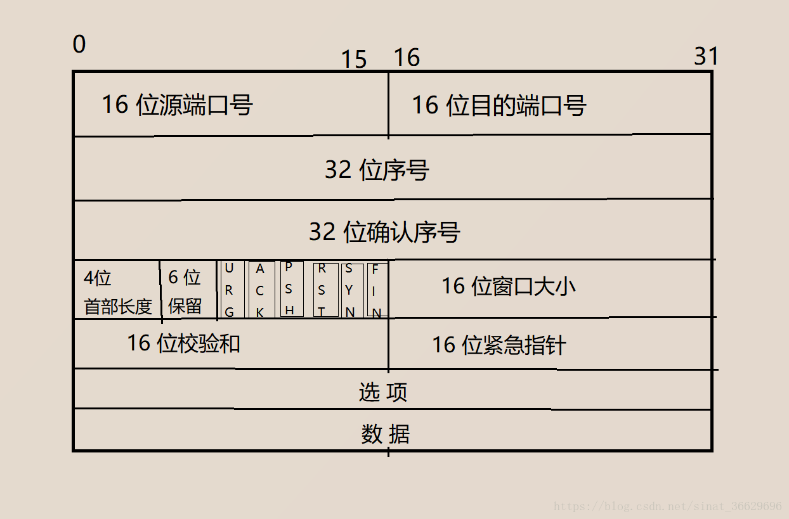

TCP协议
===

**源端口号/目的端口号**
表明数据从哪个进程来, 到哪个进程去。

**序号Seq**
发送数据包的时候，TCP 协议为每个包编号（sequence number），第一个包的编号是一个随机数，下一个包的编号=第一个包的编号+第一个包的负载长度。
例如：第一个包为1号，负载100字节，则第二个包的编号就为101。所以每个数据包都可以知道：自身的编号，下一个包的编号。接收方就可以根据编号，将包还原成原始文件。

**确认序号Ack**
传输数据时，下一个包的序号。

**控制位：URG ACK PSH RST SYN FIN**

URG：紧急标志。该标志为1，表明此报文段中有紧急数据，则紧急指针位有效。

ACK：确认标志。确认序号字段才有效。所以，在连接建立后，所有报文的传输都必须把ACK置1。

PSH：推标志。该标志为1，则接收端不将该数据进行队列处理，而是尽快响应。

RST：复位标志。表明TCP连接中出现严重差错，必须释放连接，然后再重新建立连接。

SYN：同步标志。当SYN=1，ACK=0，表明是连接请求报文，若同意连接，则响应报文中应该使SYN=1，ACK=1。

FIN：结束标志。

###  三次握手建立连接

客户端发报文给服务器：“能收到吗？”
服务器收到报文后，发报文给客户端：“你能收到吗？”
客户端收到报文后，发报文给服务器：“收到了。”
服务器收到报文后，双方都清楚对方能接收和发送报文，就可以进行数据传递了。

**第一次握手**
客户端发送SYN包(SYN=1,Seq=随机数x)到服务器，等待服务器确认。

**第二次握手**
服务器收到SYN包，将包ACK=1，Ack=x+1，同时Seq重置为新随机数y，发送给客户端。

**第三次握手**
客户端收到服务器的包，检查Ack=x+1无误，就将包的Ack置为y+1，再发给服务器，服务器检查Ack=y+1无误，则TCP连接建立成功。

###  四次挥手终止连接

客户端数据传递完了，发报文给服务器：“我没数据了，准备撤了。”
服务器收到报文后，发报文给客户端：“知道了。”
等到服务器数据也传递完了之后，发报文给客户端：“我没数据了，也要撤了。”
客户端收到报文后，发报文给服务器：“撤吧。”
服务器收到了报文，撤了。
等一段时间后，客户端也撤了。

**第一次挥手**
客户端发送一个FIN，用来关闭客户端到服务端的数据传送。

**第二次挥手**
服务端收到FIN后，发送一个ACK给客户端，确认序号为收到序号+1。

**第三次挥手**
服务端发送一个FIN，用来关闭服务端到客户端的数据传送。

**第四次挥手**
客户端收到FIN后，发送一个ACK给服务端，确认序号为收到序号+1。

客户端发送 ACK 之后不会立即关闭，因为此时还不能保证服务器接收到了这条报文，如果服务器没有接受到，会重新发 FIN 报文给客户端。客户端等一会儿，没有再收到新的 FIN 报文，说明服务器收到了 ACK 报文。