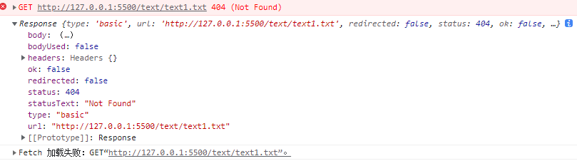
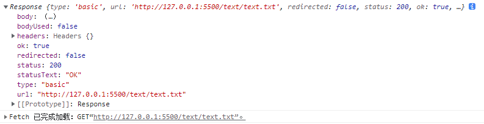

Fetch
===
fetch()用于发出 HTTP 请求，由浏览器原生提供。相比于 XMLHttpRequest ，fetch使用 Promise，不使用回调函数；而且返回的数据为数据流（Stream 对象），可以分块读取。

fetch()默认发出 GET 请求，返回一个 Promise 对象。
```
fetch(url).then(...)
```
###Response 对象
fetch()请求以后，会传递response对象，它对应服务器的 HTTP 回应。



Response对象根据服务器返回的不同类型的数据，提供了不同的读取方法：
1.`response.text()`：得到文本字符串。
2.`response.json()`：得到 JSON 对象。
3.`response.blob()`：得到二进制 Blob 对象。
4.`response.formData()`：得到 FormData 表单对象。
5.`response.arrayBuffer()`：得到二进制 ArrayBuffer 对象。
这5种读取方法都是异步的，返回的都是 Promise 对象。
```
fetch('./text/text.txt').then((response)=>{
    return response.text()
}).then((text)=>{
    console.log(text)
})
```

####clone()
response是一个 Stream 对象，只能读取一次。clone()用于创建Response对象的副本，这个副本也能读取一次。

####body 属性
返回一个 ReadableStream 对象，用来分块读取内容。

###配置对象
fetch()的第一个参数是 URL，还可以接受一个配置对象作为参数，来控制http请求。
```
fetch(url, {
    method:请求方式
    headers：请求头
    body：请求主体
})
```
