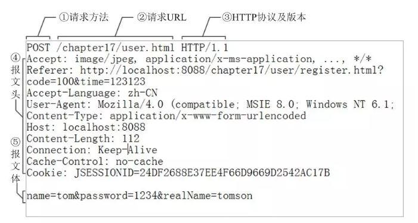

HTTP协议
===================

###  简介
HTTP基于TCP，可以传递任何格式的数据（HTML 文件, 图片文件, 查询结果等）。
HTTP协议工作于客户端-服务端架构上，浏览器作为HTTP客户端通过URL向HTTP服务端即WEB服务器发送所有请求。Web服务器根据接收到的请求后，向客户端发送响应信息。HTTP默认端口号为80，可以改为其他端口。

###  请求信息结构
客户端发送一个HTTP请求到服务器的请求消息包括以下格式：请求行（request line）、请求头部（header）、请求数据部分组成。


**状态行**：包括请求方式Method、资源路径URL、协议版本Version；
请求方法有8个：
1.GET：表示客户端想获得服务器上的资源。(无请求主体)
2.POST：表示客户端想传递数据给服务器进行处理。(有请求主体)
3.PUT：表示客户端想放置文件到服务器。(有请求主体)(在restful架构下使用)
4.DELETE：表示客户端想删除服务器上的指定文件。(无请求主体)(在restful架构下使用)
5.HEAD：表示客户端想获得服务器上指定资源的响应头部，不要详细的内容。(无请求主体)
6.CONNECT：连接测试。(无请求主体)
7.TRACE：追踪请求路径。(无请求主体)
8.OPTIONS：决定可以在服务器上执行哪些方法。(无请求主体)

**请求头部**：包括一些访问的域名、用户代理、Cookie等信息；

**请求数据**：就是HTTP请求的数据。像POST这样的方法，报文的body就包含了发送的资源，这与响应报文的body类似。



头部和实体的空行是用来区分两者，如果说在头部中间故意加一个空行会怎么样，那么空行后的内容也会被视为实体。

###  响应信息结构
服务器收到了客户端发来的HTTP请求后，根据HTTP请求中的动作要求，服务端做出具体的动作，将结果回应给客户端，称为HTTP响应。HTTP响应由三部分组成：状态行、响应头部、响应正文；

**状态行**：包括协议版本号、状态码Status Code、状态信息；
状态码一共分为5类，状态码准确的说是一个三位数。
1.1xx：表示这段信息的作用主要是提示。
2.2xx：成功的响应。
3.3xx：需要客户端重定向。
4.4xx：客户端请求错误。
5.5xx：服务器端运行错误。

200：服务器成功返回用户请求的数据。
201：用户新建或修改数据成功。
202：表示一个请求已经进入后台排队（异步任务）
204：用户删除数据成功。

400：用户发出的请求内容有错误，服务器无法操作。
401：表示用户没有通过身份验证（令牌、用户名、密码错误）。
403: 表示用户得到授权（与401错误相对），但是没有权限访问。
404：服务器找不到请求的资源。
406：用户请求的格式不可得（比如用户请求JSON格式，但是只有XML格式）。

500：服务器发生错误，用户将无法判断发出的请求是否成功。
501: 服务器不支持请求方法，因此无法处理。

**响应头部**：包括搭建服务器的软件，发送响应的时间，回应数据的格式等信息；与请求头类似。

**响应正文**：就是响应的具体数据。


**XMLHttpRequest.getAllResponseHeaders()**
XMLHttpRequest.getAllResponseHeaders() 方法返回所有的响应头，以 CRLF 分割的字符串，如果没有收到任何响应则返回null。
一个原始的header头例子：
```
date: Fri, 08 Dec 2017 21:04:30 GMT\r\n
content-encoding: gzip\r\n
x-content-type-options: nosniff\r\n
server: meinheld/0.6.1\r\n
x-frame-options: DENY\r\n
content-type: text/html; charset=utf-8\r\n
connection: keep-alive\r\n
strict-transport-security: max-age=63072000\r\n
vary: Cookie, Accept-Encoding\r\n
content-length: 6502\r\n
x-xss-protection: 1; mode=block\r\n
```
需要获取具体的一个响应头的内容，例如获取content-type，可以：
```
XMLHttpRequest.getResponseHeader("Content-Type")
```