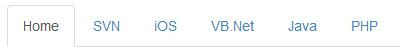
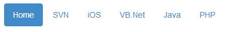
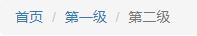

输入框与导航
===================
###输入框组件
通过在文本输入框 input 前面、后面或是两边加上文字或按钮，可以实现对表单控件的扩展。**只支持文本输入框`input`**
输入框与下拉菜单或按钮的组合只需要将按钮的`.btn-group`变为`.input-group-btn`即可

	

		<input type="text" class="form-control">
		

			<button type="button" class="btn btn-default dropdown-toggle" data-toggle="dropdown">
				下拉菜单
				
			</button>
			<ul class="dropdown-menu">
				<li><a href="#">1</a></li>
				<li><a href="#">2</a></li>
			</ul>
		

	

###导航
区域性导航组件

**标签式**
ul元素添加`class="nav nav-tabs"`

    <ul class="nav nav-tabs">
      <li class="active"><a href="#">Home</a></li>
      <li><a href="#">SVN</a></li>
      <li><a href="#">iOS</a></li>
      <li><a href="#">VB.Net</a></li>
      <li><a href="#">Java</a></li>
      <li><a href="#">PHP</a></li>
    </ul>

**胶囊式**
ul元素添加`class="nav nav-pills"`

    <ul class="nav nav-pills">
      <li class="active"><a href="#">Home</a></li>
      <li><a href="#">SVN</a></li>
      <li><a href="#">iOS</a></li>
      <li><a href="#">VB.Net</a></li>
      <li><a href="#">Java</a></li>
      <li><a href="#">PHP</a></li>
    </ul>

----------

1.可以再添加`nav-justified`实现两端对齐。
2.可以再添加`nav-stacked`实现垂直导航。

----------

**按钮式下拉菜单**
在这两种导航基础上，可以添加下拉菜单。
在添加下拉菜单处添加 `class="dropdown"`,文本处添加`class="dropdown-toggle" data-toggle="dropdown"` ul标签添加`class="dropdown-menu"`

    <ul class="nav nav-tabs">
	<li class="active"><a href="#">Home</a></li>
	<li><a href="#">SVN</a></li>
	<li><a href="#">iOS</a></li>
	<li><a href="#">VB.Net</a></li>
	<li class="dropdown">
		<a class="dropdown-toggle" data-toggle="dropdown" href="#">
			Java 
		</a>
		<ul class="dropdown-menu">
			<li><a href="#">Swing</a></li>
			<li><a href="#">jMeter</a></li>
			<li><a href="#">EJB</a></li>
			<li class="divider"></li>
			<li><a href="#">分离的链接</a></li>
		</ul>
	</li>
	<li><a href="#">PHP</a></li>
    </ul>

###导航条
全局性导航组件
**务必使用 nav 元素**

**基础内容**

	<nav class="navbar navbar-default">
		

			主要内容
			次要内容1
			次要内容2
		

	</nav>
nav的默认样式`navbar-default`灰底黑字，也可以选择`navbar-inverse`翻转为黑底白字
将导航条的内容放置于`container`或`container-fluid`内实现让导航条居中，并在两侧添加内补（padding）。

常见内容包括以下内容：
这些内容通过添加 `.navbar-left` 或 `.navbar-right`来控制对齐方式。

1.品牌logo放置于`navbar-brand`内

    
2.导航添加`.navbar-nav`

	<ul class="nav navbar-nav">
			<li class="active"><a href="#">1</a></li>
			<li><a href="#">2</a></li>
			<li><a href="#">3</a></li>
			<li><a href="#">4</a></li>
	</ul>
3.表单放置于 `.navbar-form` 内

    <form class="navbar-form navbar-left">
        

            <input type="text" class="form-control" placeholder="Search">
        

        <button type="submit" class="btn btn-default">Submit</button>
    </form>
4.按钮添加`navbar-btn`

    <button type="button" class="btn btn-default navbar-btn">Sign in</button>

5.文本与超链接
文本p添加 `.navbar-text`，超链接需要放置在文本p之内添加`.navbar-link`

    
文本与 <a href="#" class="navbar-link">链接</a>

**固定位置**
nav 添加 `.navbar-fixed-top` 类可以让导航条固定在顶部，添加 `.navbar-fixed-bottom` 类可以让导航条固定在底部

###路径导航

    <ul class="breadcrumb">
    	<li><a href="">首页</a></li>
    	<li><a href="">第一级</a></li>
    	<li class="active">第二级</li>
    </ul>

