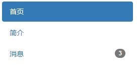

分页 徽章
===================

###分页

**页数分页**

ul添加`class="pagination"`

    <ul class="pagination">
    	<li><a href="#">&laquo;</a></li>
    	<li><a href="#">&lsaquo;</a></li>
    	<li class="active"><a href="#">1</a></li>
    	<li><a href="#">2</a></li>
    	<li><a href="#">3</a></li>
    	<li><a href="#">&rsaquo;</a></li>
    	<li><a href="#">&raquo;</a></li>
    </ul>
这里用到了[HTML转义字符][1]。

**上下页**
ul添加`class="pager"`

    <ul class="pager">
    	<li><a href="">上一页</a></li>  
    	<li><a href="">下一页</a></li>
    </ul>
默认水平居中
如果想要左右对齐，可以li标签分别对应添加`class="previous"`与`class="next"`

###标签
用于提示，说明
为哪个元素添加的标签，就放在哪个元素内：

    <h3>h3题目 h3的标签</h3>
样式包括`label-default`（灰），`label-primary`（蓝），`label-success`（浅绿），`label-info`（浅蓝），`label-warning`（暗黄），`label-danger`（红）

###徽章
用于突出显示新的或未读的项，只需要把 `span class="badge"` 添加到链接、Bootstrap 导航等这些元素上即可。

    数字
例如在列表导航中:

    <ul class="nav nav-pills nav-stacked" style="max-width: 260px;">
	<li class="active">
		<a href="#">首页</a>
	</li>
	<li><a href="#">简介</a></li>
	<li>
		<a href="#">	
			消息
			3
		</a>
	</li>
    </ul>
