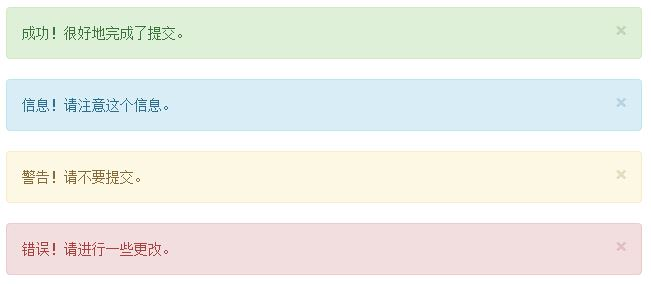

警告栏 进度条 多媒体混排
===================

###  警告栏
1.创建一个 div，并向其添加一个 `.alert`和四种类型之一（ `.alert-success`、`.alert-info`、`.alert-warning`、`.alert-danger`），警告框没有默认类，因为默认的灰色警告框并没有意义。
2.向 div元素class 添加 `.alert-dismissable`，添加一个关闭按钮button，button需要添加 `data-dismiss="alert"` 属性

    

    	<button type="button" class="close" data-dismiss="alert">
    		&times;
    	</button>
    	成功！很好地完成了提交。
    

    

	    <button type="button" class="close" data-dismiss="alert">
		    &times;
	    </button>
	    信息！请注意这个信息。
    

    

	    <button type="button" class="close" data-dismiss="alert">
		    &times;
	    </button>
	    警告！请不要提交。
    

    

	    <button type="button" class="close" data-dismiss="alert">
		    &times;
	    </button>
	    错误！请进行一些更改。
    

###  进度条
**默认样式**

    

        

            60%
        

    

在展示很低的百分比时，为了友好的让文本提示能够清晰可见，可以为进度条style设置 `min-width`。
**情境变化**
进度条组件使用与按钮和警告框相同的类，根据不同情境展现相应的效果。
也就是为内部div添加class`progress-bar-success`或`progress-bar-info`或`progress-bar-warning`或`progress-bar-danger`。

**条纹效果**
为内部div添加class`progress-bar-striped`可以实现进度条的条纹效果。
再次基础上，再添加`.active`可以实现动态条纹效果。

    

        

            60%
        

    

###  多媒体混排
实现媒体对象（图片，音频，视频）与文字的组合，在一个内容块的左边或右边展示一个多媒体内容。
常用于论坛评论或文章列表。多媒体是区域独占，而不是文本环绕。
1.将一个组合内容放置于`.media`内
2.将文本内容放置于`.media-body`内，多媒体内容放置于`.media-left`内
3.文本内容题目添加`.media-heading`，多媒体添加`.media-object`

    <!-- 左对齐 -->
    

        

            
        

        

            <h4 class="media-heading">RUNOOB</h4>
            
这是一些示例文本...

        

    

 
    <!-- 右对齐 -->
    

        

            <h4 class="media-heading">RUNOOB</h4>
            
这是一些示例文本...

        

        

            
        

    

在`class="media-left"`div标签处也可以再添加`media-top`（默认）居上,`media-middle`居中,`media-bottom`居下。

**媒体列表形式**
1.将所有内容放置于ul标签内，添加`class="media-list"`类
2.将最外层的div改为li
3.将n个组合内容依次放置于另一个组合内容的`div.media-body`标签内，这样就可以实现嵌套。

    <ul class="media-list">
    	<li class="media">
    		

                
            

            

                <h4 class="media-heading">RUNOOB</h4>
                
这是一些示例文本...

                

    		        

                        
                    

                    

                        <h4 class="media-heading">RUNOOB</h4>
                        
这是一些示例文本...
               
                    

    	        

            

    	</li>
    </ul>
