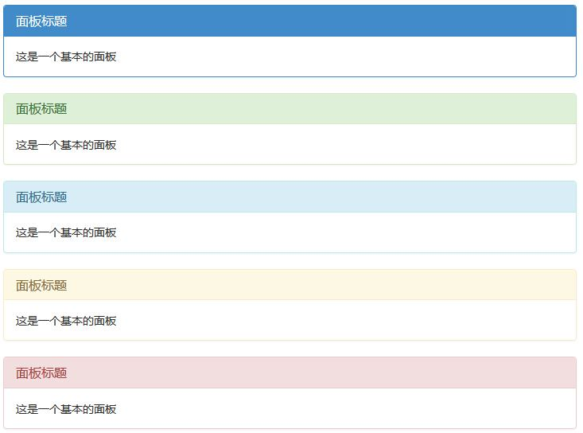

列表组 面板
===================
###列表组
用于显示一组简单的元素，还能用于复杂的定制的内容。

**基础实例**

    <ul class="list-group">
        <li class="list-group-item">AAA</li>
        <li class="list-group-item">BBB</li>
        <li class="list-group-item">CCC</li>
    </ul>
可以为列表中的条目添加情境类（`list-group-item-success`，`list-group-item-info`，`list-group-item-warning`，`list-group-item-danger`），默认样式或链接列表都可以。还可以为列表中的条目设置 `.active` 状态和`.disabled` 状态。

**链接组**
将 ul 标签替换为 div 标签，用 a 标签代替 li 标签

    

        <a href="#" class="list-group-item active">AAA</a>
        <a href="#" class="list-group-item">BBB</a>
        <a href="#" class="list-group-item">CCC</a>
    

**按钮组**
列表组中的元素也可以直接就是按钮，并且无需为每个按钮单独包裹一个父元素。
**注意不要使用标准的 .btn 类！**

    

        <button type="button" class="list-group-item">AAA</button>
        <button type="button" class="list-group-item">BBB</button>
        <button type="button" class="list-group-item">CCC</button>
    

**定制内容**
列表组中的每个元素都可以是任何 HTML 内容，甚至是像下面的带链接的列表组。

    

        <a href="#" class="list-group-item active">
            <h4 class="list-group-item-heading">题目</h4>
            
内容

        </a>
    

###面板
面板组件就是存放 DOM 内容的容器组件

**普通面板**
向 div 元素添加 class `.panel`（基础） 和 class `.panel-default` （默认）
1.标题
使用 `.panel-heading` class 向面板添加标题容器。
2.主体
使用 `.panel-body` class 向面板添加主体容器。
3.注脚
使用 `.panel-footer` class 向面板添加注脚容器。

    

    	

    		<h3>带有 title 的面板标题</h3>
    	

    	
面板内容

    	
面板脚注

    

可以将 class `.panel-default` （默认）变为 `panel-primary`、`panel-success`、`panel-info`、`panel-warning`、`panel-danger`可以设置带语境色彩的面板

    

        

            <h3 class="panel-title">面板标题</h3>
        

        
这是一个基本的面板

    

    

        

            <h3 class="panel-title">面板标题</h3>
        

        
这是一个基本的面板

    

    

        

            <h3 class="panel-title">面板标题</h3>
        

        
这是一个基本的面板

    

    

        

            <h3 class="panel-title">面板标题</h3>
        

        
这是一个基本的面板

    

    

        

            <h3 class="panel-title">面板标题</h3>
        

        
这是一个基本的面板
        

    

