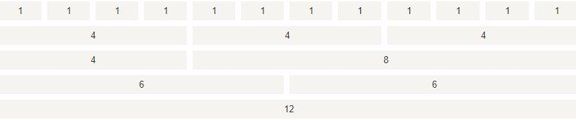
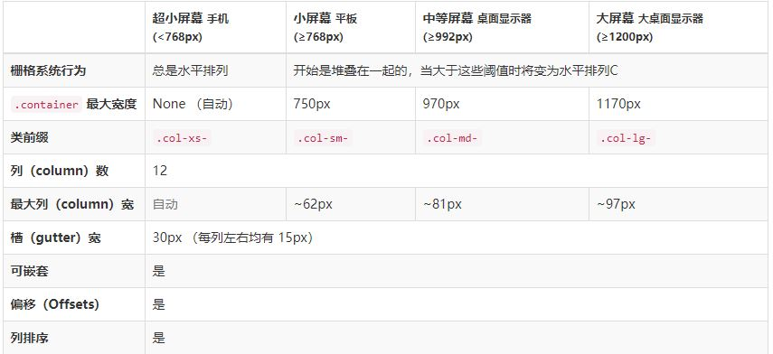

栅格系统
===================
Bootstrap 提供了一套响应式、移动设备优先的流式网格系统，随着屏幕或视口（viewport）尺寸的增加，系统会自动分为**最多12列**。

###布局容器
Bootstrap 需要为页面内容和栅格系统包裹一个 .container 容器。
1.`.container` 类用于固定宽度并支持响应式布局的容器。

    

      ...
    

这个固定宽度最大为1170px，只有屏幕宽度小于768px时，才能撑满屏幕宽度。

2.`.container-fluid` 类用于 100% 宽度，占据全部视口（viewport）的容器。

    

      ...
    

这个宽度永远为屏幕宽度。

这两种容器类不能互相嵌套。

###布局
通过一系列的行（row）与列（column）的组合来创建页面布局，内容放在这些创建好的布局中。

1.**创建行**
行必须放置在 .container class 内，以便获得适当的对齐（alignment）和内边距（padding）。

	

		

			<!-- 第一行 -->
		

		

			<!-- 第二行 -->
		

	

2.**创建列**
在“行”内创建一组“列”。内容应当放置于“列”内，并且，只有“列”可以作为行（row）”的直接子元素。

	

		

			<!-- 第一行 -->
			
1

			
2

			
3

			
4

			
5

			
6

			
7

			
8

			
9

			
10

			
11

			
12

		

	

类col-md-1中，数字表示占据的水平空间格的数量，比如col-md-2就是占据两格。一行中，列的数字和小于12，则没有撑满一行，等于12，则正好撑满一行，大于12，则多余的“列”将被作为一个整体另起一行排列。

类col-md-1中，md表示应用于pc端。

从图中可以看出，`.col-xs-`用于设定宽度小于768px的屏幕， `.col-sm-`用于设定宽度大于等于768px的屏幕，小于768px列就会单独成一行水平排列，其他类似。

	

		

			<!-- 第一行 -->
			
1

			
2

			
3

			
4

			
5

			
6

		

	

3.**列的操作**
1..列可以添加`-offset`来实现向右偏移。空出单元格。

	

		

			<!-- 第一行 -->
			
8

			
3

		

	

这样，第二个列就会向右空出一个单元格。

2.列内部可以再添加列实现嵌套.

3.列可以改变前后顺序。
添加`-push`向左移动，添加`-pull`向右移动，使用方法类似偏移。

###媒体查询
媒体查询是非常别致的"有条件的 CSS 规则"。它只适用于一些基于某些规定条件的 CSS。如果满足那些条件，则应用相应的样式。
Bootstrap默认的媒体查询的断点为 768px，992px，1200px，和默认样式container:两边padding：15px     row：两边负margin 15px     col列：两边padding：15px。
我们也可以通过媒体查询自定义栅格系统。

    @media (max-width:   @screen-xs-max) { ... }
    @media (min-width:   @screen-sm-min) and (max-width:   @screen-sm-max) { ... }
    @media (min-width:   @screen-md-min) and (max-width:   @screen-md-max) { ... }
    @media (min-width:   @screen-lg-min) { ... }