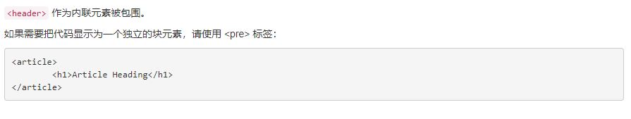

排版样式
===================
使用 Bootstrap 的排版样式，可以创建标题、段落、列表及其他内联元素。

###  标题
定义了所有的 HTML 标题（h1 到 h6）的样式。还提供了 .h1 到 .h6 类，为内联（inline）属性的文本赋予类似标题的样式。
在标题内还可以包含`small`标签或赋予 .small 类的元素，为行内元素，用来标记副标题，是一个字号更小的颜色更浅的文本，在h1-h3之内为父元素65%。h4-h6为父元素75%。

    <h1>Bootstrap heading <small>65%Bootstrap heading</small></h1>

###  文本

定义`body`全局字体`font-size`为14px；行高line-height为1.428(20px)。
`p`标签段落设置颜色为#333（深灰色），底部外边距（margin）10px。通过添加 `.lead` 类可以让段落突出显示。

**文本对齐类**

    
Left aligned text.
   //左对齐
    
Center aligned text.
 //居中
    
Right aligned text.
  //右对齐
    
No wrap text.
  //文本不换行

**字母大小写**

    
Lowercased text.
  //小写
    
Uppercased text.
  //大写
    
Capitalized text.
  //首字母大写

###  引用

使用blockquote标签包括任意的 HTML 文本达到引用效果。

    <blockquote>
	

        被引用的话
	

    </blockquote>

    <blockquote>
    	这是一个带有来源的引用。
    	<footer>这里写入来源</footer>
        //添加 <footer> 用于标明引用来源。  
    </blockquote>

    <blockquote class="blockquote-reverse">
    //通过赋予.blockquote-reverse 类或.pull-right类可以让引用呈现内容右对齐的效果。
    	这是一个右对齐的引用。
    </blockquote>

###  列表
**无样式列表**
添加类`list-unstyled`移除了默认的 list-style 样式，这是针对直接子元素的，因此需要对所有嵌套的列表都添加这个类才能具有同样的样式。

**内联列表**
添加类`list-inline`会添加少量的内补（padding），将所有li元素放置于同一行。
###  显示代码

第一种是 `code`标签。表示以内联显示代码。
第二种是 `pre` 标签。表示以一个独立的块元素来显示代码

    
<code>&lt;header&gt;</code> 作为内联元素被包围。

    
如果需要把代码显示为一个独立的块元素，请使用 &lt;pre&gt; 标签：

    <pre>
    &lt;article&gt;
    	&lt;h1&gt;Article Heading&lt;/h1&gt;
    &lt;/article&gt;
    </pre>
显示效果如下：

