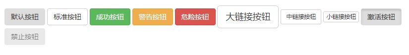

按钮
===================
为 `a`、`button` 或`input`元素添加按钮类（button class）即可使用 Bootstrap 提供的样式。
**强烈建议尽可能使用`button`元素来获得在各个浏览器上获得相匹配的绘制效果。**

1.`.btn`	
将元素默认为按钮。
**这是基础样式，其他样式基于此样式。**

2.`.btn-default`	
标准按钮

3.`.btn-success`/`.btn-info`/`.btn-warning`/`.btn-danger`	
表示成功的动作（绿色背景）/表示一般信息（浅蓝色背景） /表示需要谨慎操作的按钮	（黄色背景）/ 表示一个危险动作的按钮操作	（红色背景）

4.`.btn-lg`	/ `.btn-sm`/`.btn-xs`
这会让按钮大/小/超小（btn-lg>btn>btn-sm>btn-xs）
  
5.`.active`	
按钮添加激活效果

6.`.disabled`	
按钮将禁止使用

    <body>
    <button type="button" class="btn">默认按钮</button>
    <button type="button" class="btn btn-default">标准按钮</button>
    <button type="button" class="btn btn-success">成功按钮</button>
    <button type="button" class="btn btn-warning">警告按钮</button>
    <button type="button" class="btn btn-danger">危险按钮</button>
    <button type="button" class="btn btn-default btn-lg">大链接按钮</button>
    <button type="button" class="btn btn-default btn-sm">中链接按钮</button>
    <button type="button" class="btn btn-default btn-xs">小链接按钮</button>
    <button type="button" class="btn active">激活按钮</button>
    <button type="button" class="btn disabled">禁止按钮</button>
    </body>

