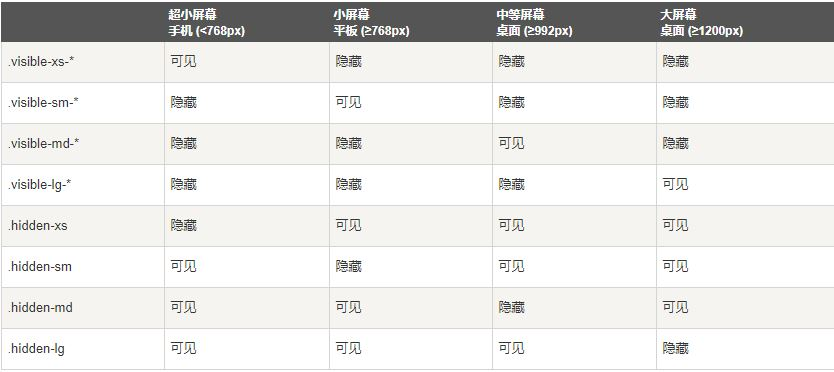
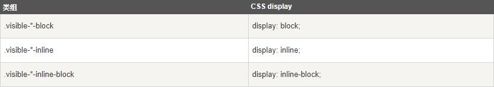

响应式显现
===================
通过媒体查询结合大型、小型和中型设备，实现内容对设备的显示和隐藏。

从 v3.2.0 版本起，形如 `.visible-*-*` 的类针对每种屏幕大小都有了三种变体，每个针对 CSS 中不同的 display 属性，列表如下：

需要以什么块级形式显示，就选择那个属性。例如，以超小屏幕（xs）为例，可用的 `.visible-*-*` 类是：`.visible-xs-block`、`.visible-xs-inline` 和 `.visible-xs-inline-block`。