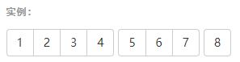

图标 按钮 下拉菜单
===================

###  字体图标
字体图标是在 Web 项目中使用的图标字体。本质仍是字体，但看起来像是小图标。
注意，为了设置正确的内补（padding），**务必在图标和文本之间添加一个空格**。

**使用方法**
创建一个嵌套的 span 标签，并将图标类应用到这个 span 标签上。

    

配合button标签使用：

	<button class="btn btn-default">
		
	</button>

###  下拉菜单
**基本格式**

    

        <button class="btn btn-default" type="button" data-toggle="dropdown">
            Dropdown
            
        </button>
        <ul class="dropdown-menu">
            <li><a href="#">Action</a></li>
            <li><a href="#">Another action</a></li>
            <li><a href="#">Something else here</a></li>
        </ul>
    

1.将按钮和下拉菜单都包裹在 `.dropdown` （向下弹出）或`.dropup`（向上弹出）内
2.为按钮设置`data-toggle="dropdown"`属性（调用js）
3.设置`class="caret"`箭头，箭头方向根据菜单弹出方向自动变换
4.下拉菜单设置`class="dropdown-menu"`。默认下拉菜单左对齐，为 100% 宽度。添加 `.dropdown-menu-right` 类可以让菜单右对齐。

**标题**

    <li class="dropdown-header">Dropdown header</li>
在下拉菜单中可以添加标题

**分割线**

    <li class="divider"></li>
在下拉菜单中可以添加分割线

###  按钮组
把一组按钮放在同一行里

**基本格式**

    

        <button type="button" class="btn btn-default">Left</button>
        <button type="button" class="btn btn-default">Middle</button>
        <button type="button" class="btn btn-default">Right</button>
    

 将按钮放置与 `.btn-group`内，如果想要竖直放置，就改为`class="btn-group-vertical"`

**按钮组组合**
可以将多个按钮组组合进一个 `
` 中形成按钮组组合

    

        
...

        
...

        
...

    

![插入图片描述][2]

**嵌套下拉菜单**
将下拉菜单放入按钮组内时，需要改动;
1.下拉菜单的`.dropdown` （向下弹出）或`.dropup（`向上弹出）改为`btn-group`
2.下拉菜单的按钮button添加`.dropdown-toggle`

    

        <button type="button" class="btn btn-default">1</button>
        <button type="button" class="btn btn-default">2</button>
    
        

            <button type="button" class="btn btn-default dropdown-toggle" data-toggle="dropdown">
                Dropdown
                
            </button>
            <ul class="dropdown-menu">
                <li><a href="#">Dropdown link</a></li>
                <li><a href="#">Dropdown link</a></li>
            </ul>
        

    

为了将下拉菜单放入按钮组进行了改动，这种下拉菜单叫做**按钮下拉菜单**

###  按钮下拉菜单
默认向下弹出，可以添加`.dropup`变为`class="btn-group dropup"`向上弹出
