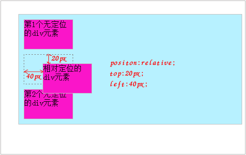

定位布局
===================
CSS定位可以将一个元素的position精确地放在页面上你指定的地方。

###  固定定位
当元素的position属性设置为fixed时，这个元素就被固定了，被固定的元素**不会随着滚动条的拖动而改变位置**。在视野中，固定定位的元素的位置是不会改变的。**固定定位元素会脱离文档流。**

    position:fixed;
    top:像素值;
    bottom;像素值;
    left:像素值;
    right:像素值;
这4个值的参考对象是浏览器窗口的4条边，一般来说，只设定top和left属性就可以了。

###  相对定位
position属性设置为relative时为相对定位，采用相对定位的元素，其位置是相对于它的初始位置计算而来的。相对定位是通过将元素从原来应该在的位置向上、向下、向左或者向右移动来定位的。
  
    position:relative;
    top:像素值;
    bottom:像素值;
    left:像素值;
    right:像素值;
**相对定位的容器浮上来后，仍然会占据原来的地方，后面的无定位元素不会占据它的位置。**

###  绝对定位
当元素的position属性值为absolute时，这个元素就变成了绝对定位元素。**绝对定位元素会脱离文档流。**绝对定位元素后面的元素会认为这个元素并不存在，占据这个位置，即这个元素浮于其他元素上面，它是独立出来的。

    position:absolute;
    top:像素值;
    bottom:像素值;
    left:像素值;
    right:像素值;

脱离文档流后，元素以css`z-index`的数字值大小来比较层次关系，数字大的在上层。如果不设置，则默认根据在html文档位置来后面覆盖前面的元素。

相对定位以文档左上角0,0位置为参考点。

**局部绝对定位**
进行局部元素相对定位，也就是改变局部元素的参考点，不再以文档左上角为参考点，而是一般以父元素左上角为参考点。

第一步：设定父元素为相对定位。
第二部：设定子元素为绝对定位。
