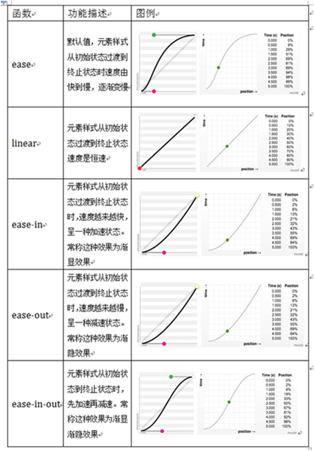

过渡
===================
可以使用`transition`属性来将元素的某一个**属性**从“一个属性值”在指定的时间内平滑地过渡到“另外一个属性值”，呈现的是一种过渡“过程”，通俗点说就是一种动画转换过程，如渐显、渐隐、动画快慢等，这样来实现动画效果。

    transition:变换的属性 持续时间 过渡方法 延迟时间;

对于CSS3过渡动画，需要配合:hover伪类来设置变换后的样式。如果有多个属性需要过渡，可以写 `transition:all  `  来表示任意属性。
延迟时间的属性默认值为0，也就是说当我们没有设置transition-delay属性时，过渡动画就没有延迟时间。

###  过渡方法
主要用来指定动画在过渡时间内的速率。
包括以下四种取值：

   
    <head>
    <title>CSS3过渡</title>
    
    </head>
    <body>
    
CSS3过渡

    </body>

  [1]: http://cn.oncedoc.com/file/view/images/HTML--CSS--JS/CSS/%E7%9B%B8%E5%85%B3%E6%96%87%E4%BB%B6/19.1.png