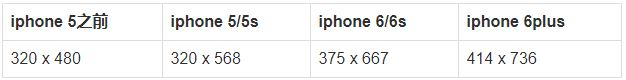

媒体查询
===================

###  引用
@media 可以针对不同的屏幕尺寸设置不同的样式，用于设置设计响应式的页面。

    @media screen and (media feature) {
        CSS-Code;
    }

**最大宽度`max-width`**
指媒体类型小于或等于指定宽度时，样式生效。

**最小宽度`min-width`**
指媒体类型大于或等于指定宽度时，样式生效。

当然，也可以例如
    
    @media screen and (min-width:960px) and (max-width:1200px){CSS-Code;}
混合使用最大宽度与最小宽度。

在引用时，可以根据不同宽度需要引用不同css文件，

    <link rel="stylesheet" media="screen and (max-width: 600px)" href="small.css" />
也可以引用一个css文件，在css文件中写入多个媒体查询。

###  实际使用
首先必须在head标签内添加

    <meta name="viewport" content="width=device-width, initial-scale=1, maximum-scale=1, user-scalable=no">
1.`width = device-width`：宽度等于当前设备的宽度
2.`initial-scale`：初始的缩放比例（默认设置为1.0）  
3.`minimum-scale`：允许用户缩放到的最小比例（默认设置为1.0）    
4.`maximum-scale`：允许用户缩放到的最大比例（默认设置为1.0）   
5.`user-scalable`：用户是否可以手动缩放（默认设置为no，因为我们不希望用户放大缩小页面）

其次设置IE渲染方式默认为最高

    <meta http-equiv="X-UA-Compatible" content="IE=Edge，chrome=1">
最后，IE8既不支持HTML5也不支持CSS3 Media，如果需要实现兼容效果，需要加载兼容JS文件。

    /* Extra small devices (phones, 600px and down) */
    @media only screen and (max-width: 600px) {
        .div {background: red;}
    }

    /* Small devices (portrait tablets and large phones, 600px and up) */
    @media only screen and (min-width: 600px) {
        .div {background: green;}
    }

    /* Medium devices (landscape tablets, 768px and up) */
    @media only screen and (min-width: 768px) {
        .div {background: blue;}
    } 

    /* Large devices (laptops/desktops, 992px and up) */
    @media only screen and (min-width: 992px) {
        .div {background: orange;}
    } 

    /* Extra large devices (large laptops and desktops, 1200px and up) */
    @media only screen and (min-width: 1200px) {
        .div {background: pink;}
    }
###  手机实际分辨率

其中，iphone4推出了Retina屏幕（视网膜屏幕），将屏幕分辨率提高，变为了原来的两倍，也就是640 x 960，但是物理尺寸是没有变，因此，需要专门处理：

    <link rel="stylesheet" media="only screen and (-webkit-min-device-pixel-ratio: 2)" type="text/css" href="iphone4.css" />
7,8，x宽度相同，只是高度上高了。