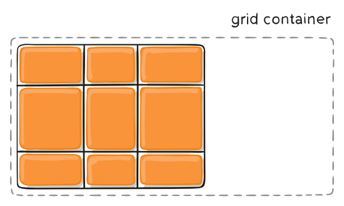

grid
===

grid将网页划分成一个个网格，可以任意组合不同的网格，做出各种各样的布局。将采用网格布局的元素，称为"容器"（container）。容器内部采用网格定位的子元素，称为"项目"（item）。
```
<div class="container">
  <div class="item"></div>
</div>
```
**网格线**
划分网格的线，称为"网格线"（grid line）。
水平网格线划分出行，垂直网格线划分出列，网格线数字从1开始。

### 容器属性
指定一个容器采用网格布局:
```
.container {
  display: grid; //块级
  display: inline-grid; //行内
}
```
容器指定了网格布局以后，需要使用grid-template-rows属性定义每一行的行高，grid-template-columns属性定义每一列的列宽。

#### grid-template-rows/grid-template-columns
这两个属性写入多少个值，就表明有多少行/列，例如：
```
.container {
  display: grid;
  grid-template-rows: 50% 50%; //两行，每行50%高度
  grid-template-columns: 100px 100px 100px; //三列，每列100px宽
}
```

**repeat()**
如果都是重复的值，可以使用repeat()函数：
```
.container {
  display: grid;
  grid-template-rows: repeat(2, 50%); //两行，每行50%高度
  grid-template-columns: repeat(3, 100px); //三列，每列100px宽
}
```
repeat()重复某种模式也是可以的:
```
grid-template-columns: repeat(3, 100px 50px); //六列，每两列重复3次，一列100px，一列50px
```
repeat()内还可以使用`auto-fill`关键字，表示尽量放：
```
grid-template-columns: repeat(auto-fill, 100px);  //容器宽度范围内，一行尽可能多的放置宽度100px的子元素
```

**fr**
fr表示子元素按照比例放置
```
grid-template-columns: 1fr 2fr; //两列，第二列宽度是第一列2倍
```

**minmax()**
`minmax()`表示接受一个范围。有两个参数，分别为最小值和最大值。
```
grid-template-columns: 1fr minmax(100px, 2fr); //两列，第二列宽度在100px到2倍第一列宽度之间
```

**auto**
auto关键字表示自适应。

#### grid-row-gap/grid-column-gap/grid-gap
grid-row-gap表示行间距，grid-column-gap表示列间距，grid-gap表示行列间距。
如果grid-gap省略了第二个值，浏览器认为第二个值等于第一个值。

#### grid-auto-flow
指定容器的子元素排列顺序包括：
```
grid-auto-flow: row;  // 默认值，先行后列
grid-auto-flow: column;  // 先列后行
grid-auto-flow: row dense; //先行后列，但是如果行还有空间放下后面的子元素，则放置这个子元素
grid-auto-flow: column dense; //先列后行，但是如果列还有空间放下后面的子元素，则放置这个子元素
```
grid-auto-flow: row如下：

grid-auto-flow: row dense如下：

grid-auto-flow: column dense如下：


#### align-items/justify-items/place-items
align-items设置单元格内容的垂直位置（上中下），justify-items设置单元格内容的水平位置（左中右），place-items是这两个属性的合并简写形式。
属性值包括：
`start`：单元格内容对齐单元格的起始边缘。
`end`：单元格内容对齐单元格的结束边缘。
`center`：单元格内容内部居中。
`stretch`：单元格内容拉伸，占满单元格。


#### align-content/justify-content/place-content
align-content属性是每一行在容器中的垂直位置，justify-content属性是每一列在容器中的水平位置，place-content是这两个属性的合并简写形式。
以justify-content为例，属性值包括：
`start`：列整体左对齐

`end`：列整体右对齐

`center`：列整体居中

`stretch`：列横向拉伸撑满整个容器

`space-around`：列两侧的间隔相等，即列与列之间距离是列和边界距离两倍

`space-between`：列之间距离相等，和左右边界没有距离

`space-evenly`：列之间和边界距离都相等


#### grid-auto-rows/grid-auto-columns
如果项目超出了容器现有的网格位置，比如容器3*3，但是项目在第4行，则可以为超出的项目添加属性grid-auto-rows/grid-auto-columns，属性值和grid-template-rows/grid-template-columns完全相同。如果不设置，则浏览器会根据项目内容自动设置。

#### grid-template-areas
容器内的项目可以使用grid-template-areas起名字，来组成区域，比如一个3*3的网格：
```
grid-template-areas: 'a b c'
                     'd e f'
                     'g h i'; // 分成a——i九个区域

grid-template-areas: 'a a a'
                     'b b b'
                     'c c c'; // 分成a——c三个区域                  
```


### 项目属性

可以指定项目的位置是在哪两根网格线之间。
```
grid-row-start: 1 //项目在网格行1开始
grid-row-end: 3 //项目在网格行3结束
grid-column-start: 1 //项目在网格列1开始
grid-column-end: 3 //项目在网格列3结束
```
此时相当于这个项目放置在容器内第一行第一列，占据4个网格。

grid-row-start和grid-row-end可以简写为`grid-row：<start-line> / <end-line>;`,grid-column-start和grid-column-end可以简写为`grid-column：<start-line> / <end-line>;`，斜杠以及后面的部分可以省略，默认占据两个网格。

也可以指定项目放在哪个区域：
```
grid-area: c //项目放在c区域（需要容器使用grid-template-areas划分了c区域）
```
grid-area还可用作grid-row-start、grid-column-start、grid-row-end、grid-column-end的合并简写。比如对上面grid-row和grid-column的简写：
```
grid-area: 1 / 1 / 3 / 3
```

#### justify-self/align-self/place-self
设置自身单元格内容的位置，和justify-items和align-items属性值相同。