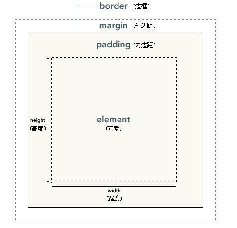
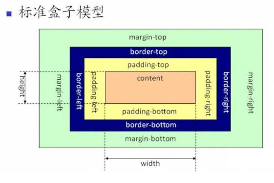
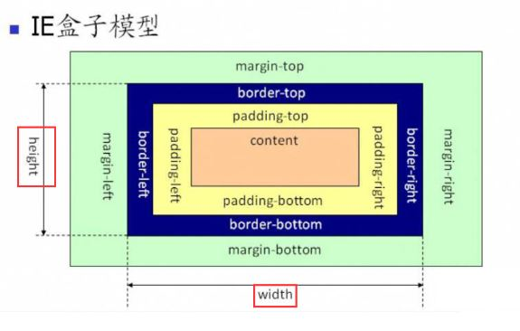

盒模型
===================

html文档中的元素包括标签和标签之间的内容，就像是一个装着东西的盒子，将其称为矩形盒子，这些矩形盒子通过一个平面模型来描述其占用空间，这个模型称为盒模型。

如图所示，盒子模型是由content（内容）、padding（内边距）、margin（外边距）和border（边框）这四个属性组成的。我们实际直观看到的就是内容区域。

 1. 内容区
只有块元素能设置width和height，行内元素无法设置。
 2. 内边距
指的是边框到内容区的空间。
包括padding-top，padding-right，padding-bottom，padding-left。
 3. 外边距
指的是边框到父元素或者同级元素之间的部分。
包括margin-top，margin-right，margin-bottom，margin-left。
当两个外边距垂直相遇时，会合成一个外边距，高度为两个外边距中较大的那个。

    margin: 0 auto;
可以设置左右外边距为 auto 使其水平居中。
 4. 边框
指的是内外边距之间的部分。

###IE盒子与W3C标准盒子

可以看出，IE盒子的width和height是包括了padding和border的宽度的。只有IE6以下的版本则使用IE盒子。所以，一般来说：
**width(宽) + padding(内边距) + border(边框) = 元素实际宽高**
也就是在设置元素的边框与内边距后，元素真实展示的高度与宽度是大于等于width的。
可以在元素上设置了 `box-sizing: border-box;` 则 padding(内边距) 和 border(边框) 会包含在 width 和 height 中（IE盒子），可以让元素以更直观的方式展示大小。

###内容溢出

有时，内容区的内容过多，超出了内容区域，就需要通过overflow属性对内容溢出部分进行处理。内容包括：
1.`overflow:hidden`（直接裁剪超出部分）
2.`overflow:scroll`（添加滚动条，裁剪超出部分）
3.`overflow:auto`（发生溢出时，添加滚动条，裁剪超出部分）。

    

    

div的宽和高一定要设置。

----------

*CSS3*
##弹性盒子模型
通过弹性盒子模型，可以创建自适应浏览器窗口的流动布局以及自适应字体大小的弹性布局，使得响应式布局实现更加容易。
任何一个容器都可以通过`display: flex;`指定为 Flex 布局。注意，设为 Flex 布局以后，子元素的float、clear和vertical-align属性将失效。

###容器的属性

**flex-direction属性**
决定容器内项目的排列方向。属性值包括：

1.row（默认值）：主轴为水平方向，起点在左端。
2.row-reverse：主轴为水平方向，起点在右端。
3.column：主轴为垂直方向，起点在上沿。
4.column-reverse：主轴为垂直方向，起点在下沿。

**flex-wrap属性**
决定横向放不下时，如何换行。属性值包括：

1.nowrap（默认）：不换行。
2.wrap：换行，第一行在上方。
3.wrap-reverse：换行，第一行在下方。

可以将`flex-direction`与`flex-wrap`写在一起为`flex-flow`。

**justify-content属性**
定义了项目如何横向对齐。具体对齐方式与项目排列方向有关。下面假设方向为从左到右。属性值包括：

1.flex-start（默认值）：左对齐
2.flex-end：右对齐
3.center： 居中
4.space-between：两端对齐，项目之间的间隔都相等。
5.space-around：每个项目两侧的间隔相等。所以，项目之间的间隔比项目与边框的间隔大一倍。

**align-items属性**
定义项目在如何纵向对齐。

flex-start：顶部对齐。
flex-end：底部对齐。
center：纵向中点对齐。
baseline: 项目的第一行文字的基线对齐。
stretch（默认值）：如果项目未设置高度或设为auto，将占满整个容器的高度。

----------

实现水平垂直居中代码：

    

        

        

    

1.flex法

    .box {
        background-color: #FF8C00;
        width: 300px;
        height: 300px;
        display: flex;//flex布局
        justify-content: center;//使子项目两端对齐
        align-items: center;//使子项目上下对齐
    }
    .content {
        background-color: #F00;
        width: 100px;
        height: 100px;
    }

2.margin:auto法

    .box{
        width: 300px;
        height: 300px;
        position: relative;
        border: 1px solid #465468;
    }
    .content{
        position: absolute;
        margin: auto;
        top: 0;
        left: 0;
        right: 0;
        bottom: 0;
    }

###容器内项目的属性

**order属性**
设置项目排列顺序数字。属性值为整数，默认为0。项目的排列顺序为数值越小，排列越靠前。

**flex-grow属性**
定义项目的放大比例，属性值为数字，默认为0，即如果存在剩余空间，也不放大。
如果所有项目的flex-grow属性都为1，则它们将等分剩余空间（如果有的话）。如果一个项目的flex-grow属性为2，其他项目都为1，则它占据的剩余空间将是其他项目的两倍。

**flex-shrink属性**
与`flex-grow`属性相反，定义了项目的缩小比例，默认为1，即如果空间不足，该项目将缩小。负值对该属性无效。
如果所有项目的flex-shrink属性都为1，当空间不足时，都将等比例缩小。如果一个项目的flex-shrink属性为0，其他项目都为1，则空间不足时，前者不缩小。

**flex-basis属性**
定义了在分配多余空间之前，项目占据的横向空间。浏览器根据这个属性，计算横向轴是否有多余空间。它的默认值为auto，即项目的本来大小。
它可以设为跟width或height属性一样的值，则项目将占据固定空间。

 
----------
上述三个属性`flex-grow`, `flex-shrink` 和 `flex-basis`合起来即为`flex`属性，对应的默认值为0 1 auto

----------
**align-self属性**
允许单个项目有与其他项目不一样的对齐方式。默认值为auto，表示继承父元素的align-items属性，其他值与align-items属性完全一致。

###不规则图形

`shape-outside`属性定义了一个可以是非矩形的盒子，相邻的内联内容应围绕该盒子进行显示。
`clip-path`属性则是对矩形内容进行切割，使得内容形状可以于盒子形状契合。

属性值可以使用:

    polygon(x1 y1, x2 y2, x3 y3);
来选择位置进行切割，x、y的值可以使用%或px，起始(0,0)点位于左下角。
