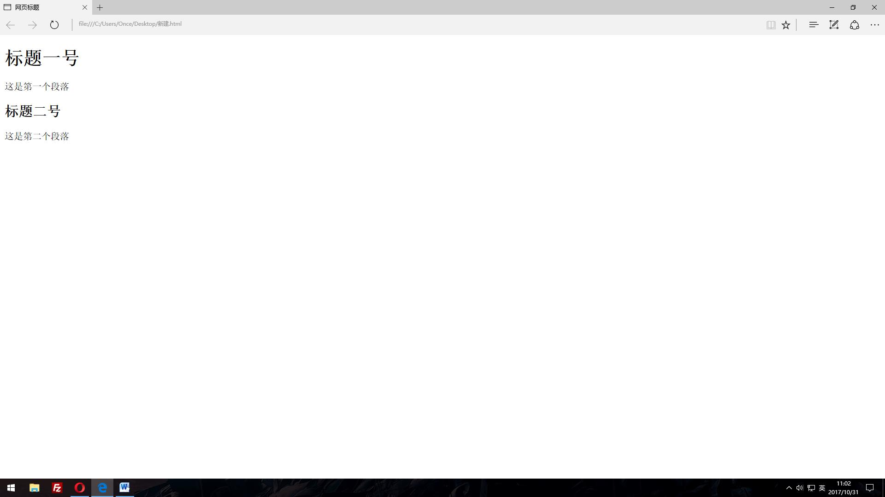

#认识HTML

## 1. html后缀

html是一种用于创建网页的标准标记语言，通过浏览器来运行。html文档的创立和编辑可以通过记事本文件更改后缀名来实现，也就是说把txt格式变换一下，可以变为html或者是htm，这两种后缀基本没有什么不同。

##2.html的最简单构成
首先，为保证浏览器正确显示内容，需要在开头打出如下内容：

      <!doctype html>
这是为了声明html版本，声明的大小写是无所谓的。

之后就是html的主体部分，直接拿一个最简单的例子来说明一下：

    <html>

    <head>
    <meta charset="utf-8">
    <title>网页标题</title>
    </head>

    <body>
    <h1>标题一号</h1>
    
这是第一个段落

    <h2>标题二号</h2>
    
这是第二个段落

    </body>

    </html>
这是一个比较基本的html内容。
 
##3.具体分析
首先从整体上来看，它是属于对称结构的，每个开头的标签都对应着结尾的标签，结尾的标签比开头标签多一个“/”。
单独来说：

    <html>  </html>
这一对标签之间是html的所包含的所有内容。

    <head> </head>
这一对标签之间是描述文档的相关属性和信息，而不是文档具体内容。可以认为与<body>元素相对应。

     <meta charset="utf-8"> 
这一标签避免了用中文而出现的乱码情况。

    <title> </title>
这一对标签之间是网页的标题。

    <body> </body>
这一对标签之间是网页的具体内容，也就是网页能呈现出直观画面及内容。
   
    <h>  </h>
这对标签之间是文章的标题，h1表示一级标题，h2表示二级标题，以此类推，可以写到h6，也就是六级标题。
    
     
 

这一对标签之间是文章正文。

以上就是对一个简单的html文档的具体分析，这个简单文档在浏览器端的表现为：

另外，还可以在段落之间或者标题与段落之间加&lt;hr&gt;标签来增加下划线，如下：

来增加距离感。
##4.注释
完成一行代码后，可以给此处的代码添加说明。说明内容需要进行注释，这样才不会对代码产生影响。注释的快捷键为ctrl+？键。

    
段落

    <!-- 上面是文章的一部分段落。 -->

###5.html，xhtml和xml

`html`
是最早写网页的语言，但是由于时间早，规范性较差。
`xhtml`
是升级版的html，对html进行了规范，编码更加严谨，使用时间比较短。
`xml`
是一种跨平台语言，更加严谨，标签必须闭合，包括空标签。
拥有非常强的扩展性，用户可以根据自身的需要自定义一些标记。
`html5`
最新html规范，是当前使用版本。