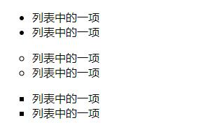
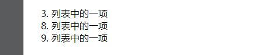

列表
===================

HTML 支持有序、无序和自定义列表。
##无序列表
无序列表中的项目不存在必要的前后关系，每个项目前使用粗体圆点进行标记。 无序列表始于 &lt;ul>标签 ,列表中每个具体项目始于 &lt;li>标签。 
type属性是无需列表最重要的属性，包括三个主要属性值，分别是disc，circle和square。其中disc是默认值，对应的是粗体圆点，circle对应中空小圆圈，square对应小方块。
比如说：
   
    

		<ul>
			<li>列表中的一项</li>
			<li>列表中的一项</li>
		</ul>
		<ul type="circle">
			<li>列表中的一项</li>
			<li>列表中的一项</li>
		</ul>
		<ul type="square">
			<li>列表中的一项</li>
			<li>列表中的一项</li>
		</ul>
	

它在浏览器中显示如下：

##有序列表
有序列表和无序列表对应存在，列表中的项目有着前后关系，通常用数字的大小来确定前后顺序。 
有序列表始于 &lt;ol> 标签。每个列表项始于 &lt;li> 标签。如下：
         
    

		<ol>
			<li>列表中的一项</li>
			<li>列表中的一项</li>
			<li>列表中的一项</li>
		</ol>
	

它在浏览器中的显示如下：

		<ol>
			<li>列表中的一项</li>
			<li>列表中的一项</li>
			<li>列表中的一项</li>
		</ol>
	

有序列表常用"type""start"等属性，type属性是定义列表项表示次序的实习或字母，属性值包括默认的数字，也可以用大写或小写的英文字母（A/a），还可以使用大写或小写的罗马数字（Ⅰ/ⅰ）。使用不同的属性值，列表项前的次序符号也就对应变化。start属性是定义列表项开始的次序，默认为1，也可以从使用start属性自定义开始次序。

除此之外，如果想要在列表项中间某一项改变次序，就需要在&lt;li>标签出添加value属性改变所在项以及后面的项的次序。
比如说：
      
    

		<ol start="3">
			<li>列表中的一项</li>
			<li value="8">列表中的一项</li>
			<li>列表中的一项</li>
		</ol>
	

在浏览器就会显示为：

##自定义列表
自定义列表就是用&lt;dl>元素定义列表，使用&lt;dt>元素定义列表项项目，使用&lt;dd>元素自定义列表项内容。比如说：

	

		<dl>
			<dt>项目1</dt>
			<dd>项目1的具体内容</dd>
			<dt>项目2</dt>
			<dd>项目2的具体内容</dd>
		</dl>
	

它在浏览器中的显示如下：

	<dl>
		<dt>项目1</dt>
		<dd>项目1的具体内容</dd>
		<dt>项目2</dt>
		<dd>项目2的具体内容</dd>
	</dl>

