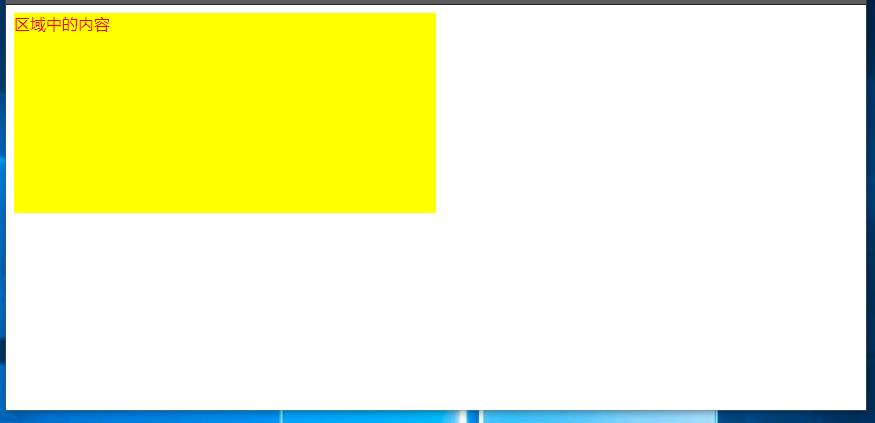
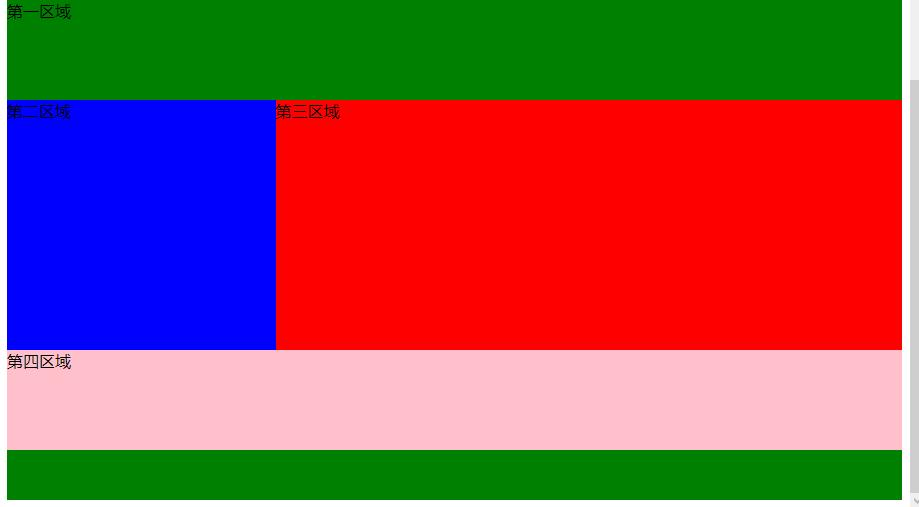

div元素与布局
===================

div元素是通用的块元素，内部可以包含其他元素。关键可以通过css来完成复杂的页面布局。
div元素默认是高度为1个字符高度，长度为100%长度的一个区域，通过css的设置，可以改变长度和高度，完成形成新的区域。

----------
###div元素
在div元素中使用**style**来改变区域的特点。比如：

    
区域中的内容

在style中，设定了区域的背景颜色为黄色，宽度为浏览器页面的50%，高度为200px，字体颜色为红色。浏览器中显示如下：

当然也可以在div元素之间使用其他的元素，包括div元素自身。比如：

    

		
第一区域

		
第二区域

		
第三区域

		
第四区域

	

就把一个div区域再分成不同的区域，在浏览器中显示如下：

###布局
HTML 可以通过区块和内联将元素组合起来。
块级元素在浏览器显示时，通常会以新行来开始（和结束）。常用包括

    <h1>, 
, <ul>, <table>
div元素是块级元素，它可用于组合其他 HTML 元素的容器。

内联元素在显示时通常不会以新行开始。常用包括
   
      <b>, <td>, <a>, 
span 元素是内联元素，可用作文本的容器。