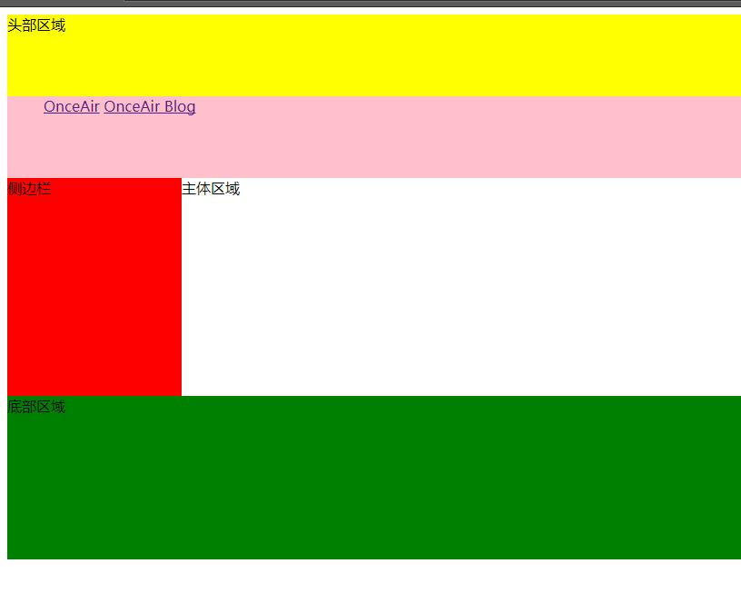

html5-布局元素
===================

##HTML5
HTML5是HTML最新的修订版本，设计目的是为了在移动设备上支持多媒体。
###  浏览器支持
现代的浏览器都支持 HTML5，此外，所有浏览器，包括旧的和最新的，对无法识别的元素会作为内联元素自动处理。这意味着，我们甚至可以自定义HTML 元素。

    <head>
    <meta charset="utf-8">
    <title>为 HTML 添加新元素</title>
     
    </head>

    <body>
    <myelement>自定义的一个新元素</myelement>
    </body>

###  改进内容
1.新语义化布局元素，方便阅读代码
2.表单元素
3.2D/3D 绘画制图的 canvas 元素
4.支持多媒体的 video 和 audio 元素
5.支持本地离线存储

##布局元素

**header元素**

通常放在文章的头部，用于设置页面标题（标题，LOGO，导航）

**nav元素**

用于给超链接分组来定义导航栏

**footer元素**

通常放在页面的页脚，用于设置网页的底部（友情链接，版权声明，联系方式，时间日期）

**aside元素**

用于设置侧边栏

**time元素**

用于放置时间信息，方便搜索引擎得到时间信息。

    <time datetime="2018-10-10">time元素是行内元素</time>

----------

下面的代码是利用在head中引入内部样式表来实现对body中元素的属性控制

    <head>
	 <meta charset="UTF-8">
	 <title>新布局</title>
	 
    </head>
    <body>
	  <header>头部区域</header>
	  <nav>
		<ul>
			<li><a href="http://onceair.com">OnceAir</a></li>
			<li><a href="http://onceair.com/blog/home">OnceAir Blog</a></li>
		</ul>
	  </nav>
	  <aside>侧边栏</aside>
	  
主体区域

	  <footer>底部区域</footer>
    </body>
它在浏览器中显示如下：
