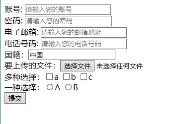
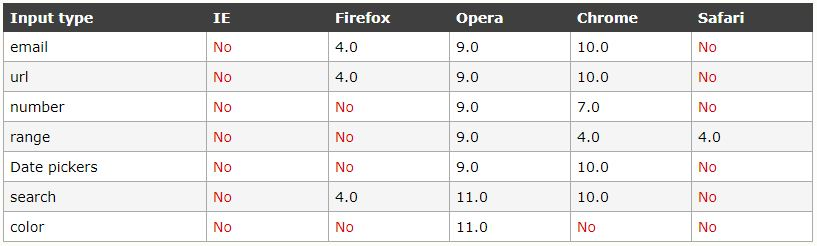

input元素
===================

input元素用来设置表单中的内容项，比如输入内容的文本框，提交按钮等。input元素不仅可以布置在表单中，还可以在表单之外的元素中使用。

###常用属性

 - **type属性：指定输入内容的类型**

常用属性值包括：

1.**text**（默认字符）
2.**password**（密码状态输入）
3.**button**（普通按钮）
4.**reset**（重置按钮）
5.**submit**（提交按钮）
6.**image**（图片提交按钮，需要在后面加上src属性设置图片的路径）
7.**email**（输入一个电子邮箱）
8.**url**（输入一个网址）
9.**tel**（输入一个电话号）
10.**number**（输入数字，通常与“min”，“max”，“step”属性配合使用，限制输入数字的最小值，最大值，数字间隔）
11.**search**（搜索框，供用户输入搜索的关键字）
12.**file**（文件选取输入框，可以添加“accept”，限制选取的文件MIME 类型，加上`multipe`属性可以一次选取多个文件，multipe属性不需要属性值）
13.**radio**（单选框，name和value属性是radio必要属性，必须要设置。而且一组选择内选项的**name属性值要一致**）
14 **checkbox**（多选框）
**浏览器支持**

即使不被支持，仍然可以显示为常规的文本域。

 - **name属性：输入内容的识别名称；传递参数时的参数名称**

 - **value属性：input元素的值**

 - **maxlength属性：输入的最大字数**

 - readonly属性：设置为只读，内容不可变更。

 - **required属性：设置为必填。（不需要属性值）**

 - placeholder属性：设置默认内容，当文本框获得内容时被清空。

 - disabled 属性：设置禁用。

```
<form action="" method="post">
    账号: <input type="text" placeholder="请输入您的账号" name="user"><br>
    密码: <input type="psssword" placeholder="请输入您的密码" name="psssword"><br>
    电子邮箱: <input type="email" placeholder="请输入您的邮箱地址" name="email"><br>
    电话号码: <input type="tel" placeholder="请输入您的电话号码" name="phone number"><br>
    国籍：<input type="texe" value="中国" readonly="readonly" name="nationality"><br>
    要上传的文件：<input type="file" name="file" multiple><br>
    多种选择：<input type="checkbox" name="a">a
    <input type="checkbox" name="b">b
    <input type="checkbox" name="c">c<br>
    一种选择：<input type="radio" name="A" value="A">A
    <input type="radio" name="A" value="B">B<br>
    <input type="submit">		
</form>
```

在浏览器中的显示如下：



----------


以上的单选框和多选框在选择时都必须点击选择框才能选中，如果想要点击选择内容也能选中就需要加入label标签。
    
    <label for=""></label>
for属性的属性值是对应选择的id，也就是说，选择型的input标签最好添加id属性，不论是单选还是多选。

    <input id="check1" type="checkbox"><label for="check1">A选项</label><br />
    <input id="check2" type="checkbox"><label for="check2">B选项</label>