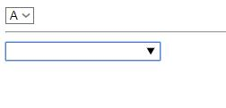

select与datalist元素
===================
###select元素
select 元素用于创建下拉菜单，可以在表单，块元素和内联元素中使用。
select 元素中的 option 标签用于定义列表中的可用选项。

**常用属性**：multiple属性：可以多选option标签中的内容。无需属性值。
      
    <form action="" method="post">
		<select>
			<option value="A">A</option>
			<option value="B">B</option>
			<option value="C">C</option>
			<option value="D">D</option>
			<option value="E">E</option>
		</select>
	</form>
###datalist元素
datalist元素用于创建下拉菜单，比select元素显示效果更强。
需要与input元素配合使用
datalist元素的内容不会直接显示在网页上，只是在用户输入或下拉时才显示。

    <form action="" method="post">
		<input type="text" name="datalist" list="WXC">
		<datalist id="WXC">
			<option value="A">A</option>
			<option value="B">B</option>
			<option value="C">C</option>
			<option value="D">D</option>
			<option value="E">E</option>
		</datalist>
	</form>
要注意list的属性值需要与id的属性值相同。
这两种元素得到的表单在浏览器中如下显示：
