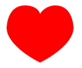

canvas元素
===================
canvas元素定义一个画布（图形容器），在这个容器内，可以使用脚本来绘制图形，画布左上角为原点（0，0）。x右方向为正，y下方向为正。

###  特点
1.canvas属性值width，height控制画布大小。
```
<canvas id="myCanvas" width="200" height="100"></canvas>
```
2.canvas 元素本身是没有绘图能力的。所有的绘制工作必须在 JavaScript 内部完成。
通过script语句获取canvas DOM对象，再创建context对象即可开始使用其API方法在canvas创建的画布上进行绘制了：

	var canvas=document.getElementById("myCanvas"); //选中canvas元素
	var ctx=canvas.getContext("2d"); //设置2D环境
getContext("2d") 对象是内建的 HTML5 对象，拥有多种绘制路径、矩形、圆形、字符以及添加图像的方法。
3.canvas只支持两种形式的图形绘制：矩形和路径。其他类型的图形都是通过一条或者多条路径组合而成的。

###  矩形
canvas提供了三种方法绘制矩形：
```
fillRect(x, y, width, height)
```
绘制一个填充的矩形
```
strokeRect(x, y, width, height)
```
绘制一个矩形的边框
```
clearRect(x, y, width, height)
```
清除指定矩形区域，让清除部分完全透明。

```
function draw() {
  var canvas = document.getElementById('canvas');
  if (canvas.getContext) {
    var ctx = canvas.getContext('2d');
    ctx.fillRect(25, 25, 100, 100);
    ctx.clearRect(45, 45, 60, 60);
    ctx.strokeRect(50, 50, 50, 50);
  }
}
```
fillRect()函数绘制了一个边长为100px的黑色正方形。clearRect()函数从正方形的中心开始擦除了一个60×60px的正方形，接着strokeRect()在清除区域内生成一个50×50px的正方形边框。


###  路径

设置样式。

	ctx.lineWidth=5;
	ctx.strokeStyle="red"  //设置笔触颜色

设置起点，终点并绘制。

    ctx.beginPath();  //开启路径
	ctx.moveTo(0,0); //移动至点（0,0）
	ctx.lineTo(300,300); //从当前点到终点（300,300）绘制直线
	ctx.stroke(); //绘制轮廓
起点和终点都可以有多个。
制作终点时可以使用lineTo起点坐标来返回至起点，也可以使用closePath()来封闭路径，这样形成封闭多边形。
使用fill()可以填充路径的内容生成实心图形。


###  绘制弧-扇形
绘制弧线使用

    arc(x,y,r,开始角度，结束角度，true/false)
注意，角度使用**弧度制（Math.PI）**，角度从十字坐标系中X轴正方向开始，顺时针一周，ture对应绘画方向逆时针，fulse对应绘画方向顺时针，为默认值。
扇形就是直线和弧线的组合

    context.moveTo();  //起点
    context.arc();  //弧线
    context.closePath();  //闭合
    context.stroke();  //绘制

###  绘制贝塞尔曲线
蓝色点为起始点和终点，红色点为控制点。

    quadraticCurveTo(cp1x, cp1y, x, y) 
绘制贝塞尔曲线，cp1x, cp1y为控制点，x,y为结束点

    bezierCurveTo(cp1x, cp1y, cp2x, cp2y, x, y) 
绘制二次贝塞尔曲线，cp1x, cp1y为控制点一，cp2x,cp2y为控制点二，x,y为结束点 

    //红色爱心
    context.fillStyle="#FF0000";  //填充的颜色
    context.beginPath();
    context.moveTo(75,40);
    context.bezierCurveTo(75,37,70,25,50,25);
    context.bezierCurveTo(20,25,20,62.5,20,62.5);
    context.bezierCurveTo(20,80,40,102,75,120);
    context.bezierCurveTo(110,102,130,80,130,62.5);
    context.bezierCurveTo(130,62.5,130,25,100,25);
    context.bezierCurveTo(85,25,75,37,75,40);
    context.fill();  //填充


###  绘制文字

    strokeText（"文字"，x，y）//绘制边框-实心
    fillText（"文字"，x，y）//绘制文本-空心
    font（）//字体样式