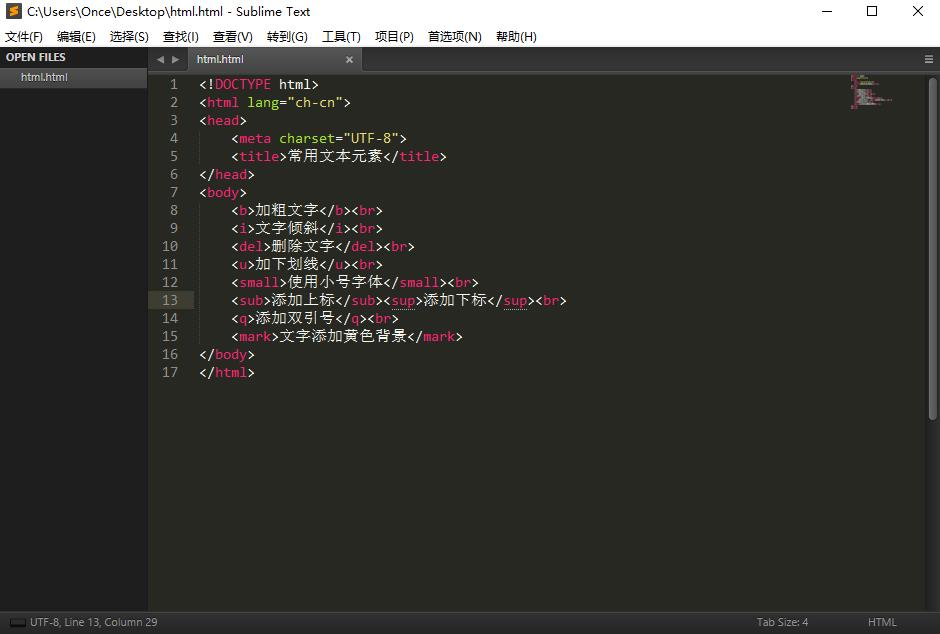
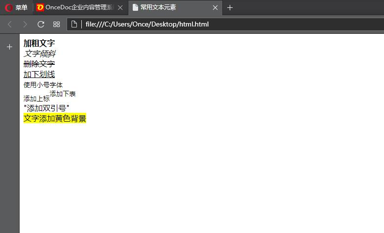

文本元素
===================

1.b元素
    
    <b> 加粗文字  
2.br元素（单标签）

      强制换行
在某句话后添加该元素，则下句话会在另起一行开始。

3.i元素
    
    <i> 文字倾斜
4.del元素
    
    <dle> 删除文字（在文字中间水平添加一条直线）  
5.u元素

    <u> 加下划线
6.small元素

    <small> 使用小号字体
7.sub和sup元素

     添加下标  添加上标
8.q元素
    
    <q> 添加双引号
9.mark元素

    <mark> 文字添加黄色背景

