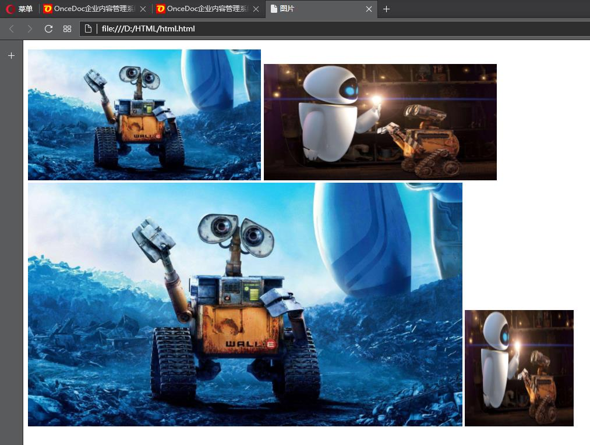

img插入图片
===================
文本中插入图片时需要使用的元素为&lt;img&gt;元素，&lt;img&gt;元素是单标签元素。&lt;img&gt;元素包含三个重要的属性，分别为src，alt，width/height。


##src
src属性是最重要的属性，指定图片来源路径。图片来源包括本地图片和网络图片，区别就在于一种存放在本地，一种存放在网络上。不管是哪一种，都要完整写出图片的名字/来源+后缀。路径分为相对路径和绝对路径。

##alt
alt属性在图片出现错误无法显示之后，给图片增加一个说明，主要是为了防止图片挂掉了以后，别人无法知道图片是关于什么的。

##height/width
height规定图片的高度，width规定了图片的宽度。单位分为像素和百分比。百分比是图片占用整个浏览器界面的百分比。通常来说，width属性可以使用像素和百分比，而height只能使用像素。因为html理论上可以一直往下写，对应浏览器界面的长度是可以一直往下的延伸的，那么长度的百分比就没有意义了。如果只输入height或width当中的一个，那么图片会按照原比例进行放大或缩小来满足要求。

通过例子说明一下：

    <!DOCTYPE html>
    <html lang="zh-cn">
    <head>
	  <meta charset="UTF-8">
	  <title>图片</title>
    </head>
      <body>
        <p>
    	    
    	    <br>
    	    
    	    
        </p>
      </body>
    </html>


代码中使用的链接是对应着上面添加的图片的，属性有明显的不同。所使用到的素材在“相关文件”这个文件夹内。它所对应的页面如下：


其中没有展示出alt属性，因为使用图片内容和路径都是正确的，因此没有产生错误显示。src属性中路径使用的是相对路径，相对路径和绝对路径的问题要了解如何插入连接之后再具体讨论。


除了上面三个非常常用的属性外，还有一个比较常用的属性，就是title属性，它可以对图片进行文字说明，效果是在浏览器中，当我们把鼠标移到图片上时，会显示出你在title属性中输入的字符内容。


----------


###标签栏图标
网站的页面在浏览器标题栏也会有一个小图标，这个效果，需要在head标签内使用link标签来实现。

    <link rel="shortcut icon" type="image/x-icon" href=" ">
其中，rel和type的属性值是固定的，在herf引入图标链接。这个小图标的格式是.ico格式的，是一种体积很小的图片格式。这个格式的图标制作，可以搜索“在线icon”找在线工具直接制作。

###图像映射
与map标签绑定使用，用来给图像部分区域设置可点击的特殊的含义。
使用Tab键索引高亮就可以看见设置好的轮廓范围。

    
    <!-- usemap属性值一定要带#号 -->
    <map name="planetmap" id="planetmap">
        <area shape="rect" coords="20,20,80,80" href="" alt="矩形">
        <area shape="circle" coords="200,50,50" href="" alt="圆形">
        <area shape="poly" coords="150,100,200,120,180,130,190,180,150,150,100,160,140,120,100,110" href="" alt="多边形">
    </map>
1.img 中的 usemap 属性值引用 map 中的 id 或 name 属性（由浏览器决定）
2.所以需要同时向 map 添加 id 和 name 两个属性。
3.area标签定义了图像中被赋予特殊含义的区域，属性有shape、cooreds、href、alt（必要）、target。
**shape属性**
定义了相关区域的形状，属性值`default`（默认值）规定全部区域，`rect`规定区域为矩形，`circle`规定区域为圆形，`poly`规定区域为多边形
**cooreds属性**
定义相关区域的坐标，和shape属性搭配使用
（1）当shape属性为`rect`时，代表矩形，则cooreds属性值为(x1,y1,x2,y2),其中x1,y1为左上角的坐标，x2,y2为右下角的坐标；
（2）当shape属性为`circle`时，代表圆形，则cooreds属性值为(x,y,radius),其中x,y为圆形的中心坐标，radius为圆形的半径；
（3）当shape属性为`poly`时，代表多边形，则cooreds属性值为(x1,y1,x2,y2,x3,y3......xn,yn),规定了多边形各个顶点的坐标，由于浏览器会自动闭合多边形，所以尾部坐标不必与第一个坐标相等。
**target属性**
定义了在何处打开目标链接，属性值`_self`（默认）在当前窗口打开被链接的文档，`_blank`在新窗口打开被链接的文档

###Data URL
Data URL由四个部分组成：前缀 (data:)、数据类型MIME(默认text/plain)、（可选）base64标记、数据本身：
```
data:[<mediatype>][;base64],<data>
```
如果数据是文本类型，可以直接将文本嵌入，如果是二进制数据，就需要将数据进行 base64 编码之后再进行嵌入。
例如一张图片的DataURL：
```
data:image/png;base64,图片base64数据
```
一行文本（Hello World!）的DataURL：
```
data:,Hello%2C%20World!
data:text/plain;base64,SGVsbG8sIFdvcmxkIQ==
```
这样做的目的是，将一些小的数据，直接嵌入到网页中，从而不用再从外部文件载入，减少请求资源的链接数。