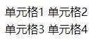
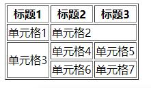

表格
===================
代表表格文件的元素是table元素，由它来控制一个表格的大小和外框，表格分为行和行中的单元格。
##基本要素
**主体**
表格的基本要素就是三个元素，分别为“table”,"tr"和"td"。这三个元素分别对应表格框体，表格的行，行中的单元格。table元素是表格最基本的元素，其他元素都在包含在table元素里面。表格有多少行，就添加多少tr元素，每一行有多少个单元格，就在每一行元素中添加多少个td元素。

比如说。想要创立一个两行两列的表格，就可以如下输入：
      
    <table>
		<tr>
			<td>单元格1</td><td>单元格2</td>
		</tr>
		<tr>
			<td>单元格3</td><td>单元格4</td>
		</tr>
	</table>
在浏览器端的显示如下：

这个表格没有边框，因为table元素没有添加属性。可以在table标签后添加border属性来增加边框，border属性对应边框的宽度，通常使属性值为1就可以了。

**主标题**
caption 标签来标记表格的标题，标题的位置默认居中

    <table>
        <caption>表格主标题</caption>
        <tr>
            <td>Month</th>
            <td>Savings</th>
        </tr>
    </table>

**列标题**

th元素是在表格单元中使用标题，th元素的内容会自动居中对齐，同时还有加粗效果。也就是说th元素中的内容往往是作为表格中标题单元存在的。因为th元素是对应单元格中的内容，可以取代td元素的内容，必须在tr元素中间。

##表格属性

 
1.colspan属性

colspan的意思是合并列，colspan属性对应也是合并列的命令，表示该单元格横向合并。属性值为正整数，合并几格属性值就是几。colspan属性使用在单元格标签后。

2.rowspan属性

和colspan属性类似。rowspan属性对应着就是纵向合并。

用法如下：

    

		<table border="1">
		    <tr>
			    <th>标题1</th><th>标题2</th><th>标题3</th>
			</tr>    
			<tr>
				<td>单元格1</td><td colspan="2"> 单元格2</td>
			</tr> 
			<tr>
				<td rowspan="2"> 单元格3</td><td>单元格4</td><td>单元格5</td>
			</tr>   
			<tr>
			    <td>单元格6</td><td>单元格7</td>	
		    </tr>
	    </table>
	

在浏览器中的显示如下：

