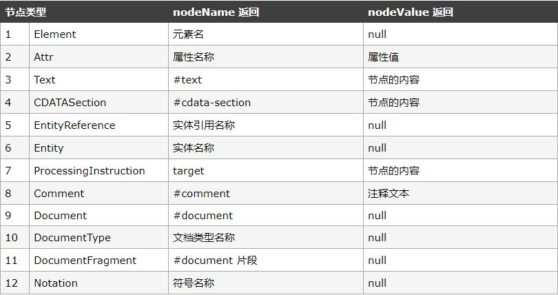

DOM对象
===================
在JavaScript内，html是像树叉一样的层级结构，每一层就是一个DOM，通过DOM可以访问 HTML 文档的所有层级节点，每一个DOM节点就是一个“对象”。

###遍历获取节点/元素

 - parentNode /  parentElement
当前节点的父节点 / 元素

 - childNodes / children
当前节点的子节点 / 元素集合

 - firstChild / firstElementChild	
当前节点的第一个子节点 / 元素

 - lastChild / lastElementChild
当前节点的最后一个子节点 / 元素

 - previousSibling / previousElementSibling
当前节点的前一个兄弟节点 / 元素

 - nextSibling / nextElementSibling
当前节点的后一个兄弟节点 / 元素

节点返回的值除了元素，也会返回换行等不需要的元素，所以需要取出需要的节点：

    for (var i=0, len=element.childNodes.length; i < len; i++){ 
        if (element.childNodes[i].nodeType == 1){ 
            //执行某些操作
        } 
    }
其中`nodeType`的值表示节点类型，有12个值：

###操作元素节点

1.**getElementById("id")**
getElementById()方法类似于CSS中的id选择器。

    document.getElementById("元素id");

2.**getElementsByName(name) 与 getElementsByTagName(name)**
通过name/Tagname(元素名)来选中元素。

    document.getElementsByName("表单元素name值");
    document.getElementsByTagName("元素名");
其返回值是一个伪数组（因此，elements后面是有s字母的），而不是一个元素。
因此，想要获取具体的某一个元素，就需要括号后添加数组下标[n]来获取（name主要用于属性为radio的input元素，n从0开始）。
3. **querySelector() 与 querySelectorAll()**
 返回文档中匹配指定 CSS 选择器的第一个元素和所有元素列表。

    document.querySelector(selectors);
    document.querySelectorAll(selectors)[n];

处理节点的内容时还要进一步再次获取。
例如html文档的内容（ .innerHTML），input的属性（.value）以及元素的属性（.属性名）等，对于元素的CSS属性操作，使用的是DOM对象中的style对象（.style.属性名）来操作。
可以获取，也可以编辑：
    
    var 变量名=DOM对象.style.属性名  //获取
    DOM对象.style.属性名="属性值"    //编辑
需要注意，**属性名中单词从第二个起，需要大写首字母**。例如：

    font-size应写为fontSize

----------

###新节点
使用节点是必需要先创建节点，之后才能进行其他的操作。

 1. 创建节点
用document对象中的createElement()和createTextNode()这2种方法创建一个节点，然后再通过appendChild()、insertBefore()等方法把新元素节点插入现有的元素节点中去。

        var 变量a = document.createElement("元素名");    //创建元素节点
        var 变量b= document.createTextNode(元素内容);    //创建文本节点(字符串加引号)
        a.appendChild(b);   //把文本内容插入元素中去
        document.body.appendChild(变量a);    //插入文档内一定要document.body
 2. 插入子节点

        父节点a.appendChild(子节点b)；
把节点b插入到当前节点a的“内部”。

        父节点a.insertBefore(子节点b,子节点c);

把节点b插入到当前节点a的“内部”节点c前面。

3.删除节点

    节点a变量.removeChild(节点a内的子节点变量)；
如果子节点的父元素是文档body，则变为

    document.body.removeChild(子节点变量);

4.替换节点

    父节点变量.replaceChild(新子节点变量,旧子节点变量)

5.复制节点

    节点变量.cloneNode(Boolean)；
布尔值取值如下：

（1）1或true：表示复制节点本身以及复制该节点下的所有子节点；

（2）0或false：表示仅仅复制节点本身，不复制该节点下的子节点；

###元素节点
**属性**

    node.attributes  //返回属性数组
    node.setAttribute("name","value");  //创建属性
    node.removeAttribute("name");  //删 除属性
    node.getBoundingClientRect() //获取DOM基本位置大小属性

**样式**

在 style 特性中指定的任何 CSS 属性都将表现为这个style 对象的相应属性。对于使用短划线分隔（例如 background-image）的 CSS 属性名，必须将其转换成驼峰大小写形式。

    myDiv.style.backgroundColor   //返回属性值
    myDiv.style.backgroundColor = "red";  //设置属性值
对于width和height只能取得内联样式的值，但可以进行设置。

**类名**

    node.classList	返回元素的类名数组，作为 DOMTokenList 对象。
包含属性：length；方法：
1.add(class1, class2, ...)	
在元素中添加一个或多个类名。
2.contains(class)	
返回布尔值，判断指定的类名是否存在。
3.item(index)	
返回元素中索引值对应的类名。索引值从 0 开始。
4.remove(class1, class2, ...)	
移除元素中一个或多个类名。
5.toggle(class)
在元素中切换类名。

    node.className	设置或返回元素的class属性

**偏移量**(无单位)

1.element.clientHeight	
在页面上返回内容的可视高度（不包括边框，边距或滚动条）
2.element.clientWidth	
在页面上返回内容的可视宽度（不包括边框，边距或滚动条）

1.offsetHeight
元素在垂直方向上占用的空间大小，以像素计。包括元素的高度、（可见的）水平滚动条的高度、上边框高度和下边框高度。不包括margin的元素的高度
2.offsetWidth
元素在水平方向上占用的空间大小，以像素计。包括元素的宽度、（可见的）垂直滚动条的宽度、左边框宽度和右边框宽度。不包括margin的元素的高度
3. offsetLeft
元素的左外边框至包含元素的左内边框之间的像素距离。
4. offsetTop
元素的上外边框至包含元素的上内边框之间的像素距离。

**滚动大小**
指的是包含滚动内容的元素的大小。

1.scrollHeight
返回整个元素的高度（包括带滚动条的隐蔽的地方）
2. scrollWidth
返回元素的整个宽度（包括带滚动条的隐蔽的地方）
3. scrollLeft
被隐藏在内容区域左侧的像素数。
4.scrollTop
被隐藏在内容区域上方的像素数。

