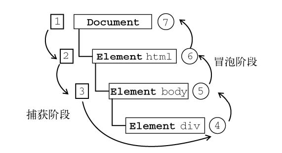

JS事件
================
###事件流
事件流包括三个阶段：事件捕获阶段、处于目标阶段和事件冒泡阶段。首先发生的是事件捕获，为截获事件提供了机会。然后是实际的目标接收到事件。最后一个阶段是冒泡阶段，可以在这个阶段对事件做出响应。

实际的目标（<div>元素）在捕获阶段不会接收到事件。这意味着在捕获阶段，事件从 document 到<html>再到<body>后就停止了。下一个阶段是“处于目标”阶段，于是事件在<div>上发生，并在事件处理中被看成冒泡阶段的一部分。然后，冒泡阶段发生，事件又传播回文档。


###事件调用
响应某个事件的函数就叫做事件处理程序，事件处理程序的名字以"on"开头。

1.在script标签中调用；
首先使用document.getElementById(" ")来获取一个元素节点，再赋值给一个变量，之后添加该变量事件就可。

    var 变量名 = document.getElementById("元素id");
    变量名.on事件= function()
    {
    执行内容
    }


----------


    <input id="c" type="button" value="点击" />
    <script type="text/javascript">
        var e = document.getElementById("c");
        e.onclick = function () {
            alert("由点击触发事件");
        }
    </script> 

2.在元素中调用；
在元素的某一个属性中直接编写JavaScript程序或调用JavaScript函数。

    <input type="button" onclick="alert('由点击触发事件')" value="点击"/>

3.dom事件监听——addEventListener()

    element.addEventListener("event", function, useCapture);
参数useCapture是布尔值。如果是true，表示在事件捕获阶段调用事件处理程序；如果是false，表示在事件冒泡阶段调用事件处理程序。

    document.getElementById("button").addEventListener("click",function(event){
            alert("button");
            event.stopPropagation();    //阻止事件冒泡
        },false);

一个事件可以添加多个事件处理程序，按照添加它们的顺序依次触发。
**通过addEventListener()添加的事件处理程序只能使用removeEventListener()来移除**。移除时传入的参数与添加处理程序时使用的参数相同，这也意味着通过addEventListener()添加的匿名函数将无法移除（两个一样的匿名函数不是相同的函数），因此需要函数写为非匿名函数，并写在事件外:

    var btn = document.getElementById("myBtn");
    var handler = function(){
        alert(this.id);
    };
    btn.addEventListener("click", handler, false);
    btn.removeEventListener("click", handler, false); 
    
为事件监听器进行传参时，需要将传参函数放置在匿名函数内：
```
var btn = document.getElementById("button");
btn.addEventListener("click", function(){btnClick("参数")}, false);
```    
如果需要具名函数传参，有两种方法：
方法一：参数绑定到event的属性上：
```
element1.addEventListener('click',fun1)
function fun1(){
    element2.addEventListener('click',fun2);
    element2._attr=param
}
function fun2(e){
    console.log(e.target._attr)  //param
}
```
方法二：使用bind(null,param)
```
element1.addEventListener('click',fun1)
function fun1(){
    element2.addEventListener('click',fun2.bind(null,param));
}
function fun2(param){
    console.log(param)  //param
    console.log(arguments)  //[param,event]
}
```
###事件对象
在触发 DOM 上的某个事件时，会产生一个事件对象 `event`，这个对象中包含着所有与事件有关的信息。

**方法**
1.preventDefault()
取消事件的默认行为。

2.stopPropagation()
取消事件冒泡。

**全局属性**
1.target
触发事件的目标元素

2.type 
被触发的事件类型

3.timeStamp
事件发生时距离客户端（浏览器）启动的毫秒时间

    div.onclick = function(event){ 
        alert(event.type); //"click" 
    }; 
    div.addEventListener("click", function(event){ 
        alert(event.type); //"click" 
    }, false);

**鼠标键盘属性**
1.button
事件发生时按下的鼠标键（0-左，1-中，2-右）

2.altKey	
返回当事件被触发时，"alt" 是否被按下。
metaKey	
返回当事件被触发时，"meta" 键是否被按下。
shiftKey	
返回当事件被触发时，"shift" 键是否被按下。

3.offsetX / offsetY
事件发生时鼠标距离元素边缘的左/上距离
clientX / clientY
事件发生时鼠标距离浏览器边缘的左/上距离
screenX / screenY
事件发生时鼠标距离设备屏幕边缘的左/上距离
pageX / pageY
事件发生时鼠标距离文档的左/上边缘距离

###事件委托
添加到页面上的事件处理程序数量将直接关系到页面的整体运行性能，对“事件处理程序过多”问题的解决方案就是事件委托。事件委托利用了事件冒泡，只需在DOM 树中尽量最高的层次上添加一个事件处理程序，就可以管理某一类型的所有事件。

    //li的点击事件委托给ul
    var ul = document.getElementById("ul");
    ul.addEventListener("click",function(event){
        //防止父元素ul也触发事件
        if(event.target.nodeName == "LI"){
              event.target.style.backgroundColor = "red";
        }
    })
如果分别触发不同的事件，也可以通过选择程序进行处理：

    if(event.target.nodeName.toLocaleLowerCase() == 'input'){
        switch(event.target.id){
            case 'add' :
            alert('添加'); break;
            case 'remove' :
            alert('删除');break;
            case 'move' :
            alert('移动'); break;
        }
    }


###鼠标事件

click(单击)
dblclick(双击)
mouseleave(鼠标移出) 
mouseenter(鼠标移入)
mousedown(鼠标按下)
mouseup(鼠标弹起)
mousemove(鼠标移动)

阻止页面默认右击弹出框：

    document.oncontextmenu = function(event){
	    event.preventDefault();
	};
只触发一次点击事件：

    var btn = document.getElementById('#btn');
    // 添加事件绑定
    btn.addEventListener('click', btnClick, false);

    // 按钮点击方法
    function btnClick() {
      console.log('hello');
      // 删除事件绑定
      btn.removeEventListener('click', btnClick, false);
    }

###键盘事件

keydown(键按下)
keypress(按键)
keyup(键起来)

###表单事件
focus和blur
focus表示获取光标触发的事件，blur表示失去光标触发的事件。
change
当表单的值改变时且失去焦点触发的事件（包括下拉列表，文件上传）。
input  
当表单的值发生变化时就会触发
select
选中文本时触发的事件。

###编辑事件
常见的编辑事件有：
copy
复制事件；

    <script type="text/javascript">
        document.body.oncopy=function(){
            alert("版权所有，禁止复制！");
            return false;  //返回false，表示屏蔽复制功能
        }
    </script>

cut
剪切事件；
paste
粘贴事件；

在网页中编辑内容时会触发编辑事件，可以通过具体事件来禁止（return false）用户编辑网页内容。

###页面事件

load:加载事件,在文档加载完毕再执行的事件。
scroll:滚动事件

----------


一个错误代码：

    <!DOCTYPE html>
    <html xmlns="http://www.w3.org/1999/xhtml">
    <head>
        <title></title>
        <script type="text/javascript">
            document.getElementById("btn").onclick = function () {alert("JavaScript"); }
        </script>
    </head>
    <body>
    <input id="btn" type="button" value="提交" />
    </body>
    </html>
其中JS代码是无法执行的。因为浏览器对一个页面是从上到下进行解析的，当浏览器解析到js代码是，没有后面的id数据，就无法进行执行。因此，需要将js代码改为

        <script type="text/javascript">
        	window.onload=function(){
            document.getElementById("btn").onclick = function () {alert("JavaScript"); };}
        </script>

这样，js代码就会在页面执行完成后再执行。或者使用下面的代码：

    <!DOCTYPE html> 
    <html lang="en">
    <head>
    <title></title>
        <script type="text/javascript">
            function alertjs(){
            	alert("JavaScript");
            }
        </script>
    </head>
    <body>
    <input id="btn" type="button" value="提交" onclick="alertjs()">
    </body>
    </html>
和上面错误的代码差别在于这段代码前面只是函数，函数本身不会自己执行，在调用时才会执行。