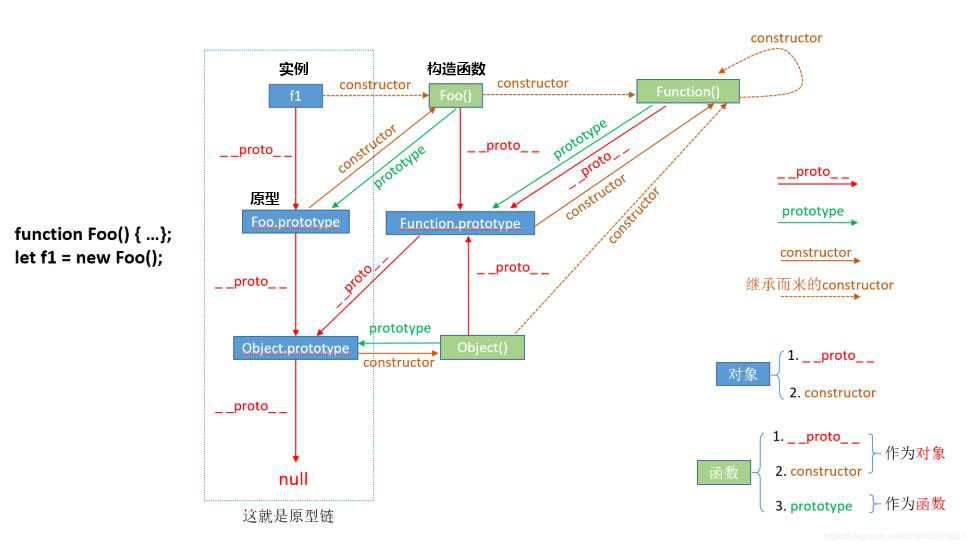
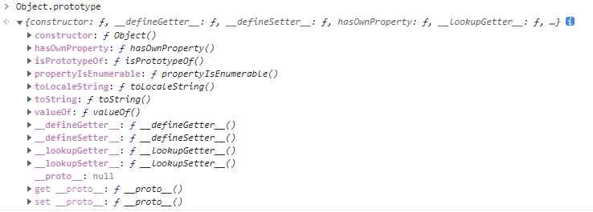

面向对象
===================
属性是对象的状态，方法是对象的行为。面向对象就是将实物抽象成对象模板（称为类/`class`），使用类这个抽象概念来总结描述具有相同特征的实物。之后，通过这个类就可以生成具体的实物。


###  创建对象
实际是设定属性和方法。

**基本模式**
1.使用new操作符和Object()构造函数
 
    var person = new Object()  //new关键字创建Object
    person.name="小明";
    person.age=25;
    person.action=function(){
        alert(this.name)
    };
这样，就创建了一个名为person的对象。
    
    alert(people.name);  //弹出小明
    alert(people.action());  //弹出小明
2.使用字面量表示法(推荐)

    var person={
        name:"小明",  //使用逗号
        age:25  //最后一个不要添加逗号
    }


**工厂模式/函数模式**
将创建对象的语句放在一个函数里，通过传入参数来创建特定对象，最后返回创建的对象。

    function people(name,age){
    	var person=new Object;
    	person.name=name;
    	person.age=age;
    	person.action=function(){
    		alert(this.name)};
    	return person;	 //返回对象
    	};
现在建立了一个对象函数，需要时向该函数传递参数就能创造对象：

    var xiaoming= people("小明","25");  //创建对象
    alert(xiaoming.name)
以上就是工厂模式，还可以进一步改进为**函数模式**。

    function People(name,age){
    	this.name=name;
    	this.age=age;
    	this.action=function(){
    		alert(this.name)};	
    	};
People()函数取代了 people()函数，具有以下特点：
1. 没有显式地创建对象；
2. 直接将属性和方法赋给了 this 对象；
3. 没有 return 语句。
将其称为构造函数，一般大写第一个字母。
要创建构造函数的新实例，必须使用 new 操作符。先使用new关键字创建对象，再访问：

    var xiaoming=new People("小明","25");  //new关键字将this指向从window对象变为new创建的对象
    alert(xiaoming.name)

或者使用`call()`和`apply()`方法实现**对象冒充**，也就是：

    var xiaoming= new Object;
    people.call(xiaoming,"小明","25");  //people.apply(xiaoming,["小明","25"]) 两种方法传参不同
    alert(xiaoming.name)

**原型(prototype)模式**
js中，每个构造函数都有一个prototype属性，它指向一个对象，叫做原型对象，这个对象的属性和方法会被构造函数的实例公用，继承。因此，可以将不变的属性和方法绑定在prototype上。

    function Person(){};
    Person.prototype={
    		name:"小明",
    		age:"25",
    		action:function(){return this.name}
    }
    //Person.prototype.name="小明";
    //Person.prototype.age="25";
    //Person.prototype.action=function(){return this.name};
原型对象都会自动获得一个 constructor（构造函数）属性，这个属性包含一个指向 prototype 属性所在函数的指针。也就是：
Person.prototype. constructor 指向 Person。

使用关键字new创建对象并访问：

    var people=new Person();
    alert(people.action())
所有由这个构造函数所创建的对象实例都继承了函数所拥有的相同的属性和方法，并且这些内容放置在相同的内存空间中。每个实例也可以再创建自己的新属性和方法：

    var people2 = new person();
    people2.sex = 'female';
当要读取某个对象的属性时，都会执行一次搜索，搜索首先从对象实例本身开始，如果在实例中找到了这个属性，则搜索结束，返回实例属性的值；若实例上没有找到，则继续向对象的原型对象延伸，搜索对象的原型对象，若在原型对象上找到了，则返回原型上相应属性的值，若没有找到，则返回undefined。因此，实例对象属性会覆盖原型对象上的同名属性。

这种方式创建对象具有位于同一内存空间的相同属性值，这也产生了问题，一个对象的共有属性变化会引起其他所有对象的属性变化。

**混合模式**

是目前**最常用模式**
使用构造函数定义对象属性。用原型模式构造方法


    function Person(name,age){
    	this.name=name;
    	this.age=age;
    };
    Person.prototype={
    	action:function(){return this.age}
    }
使用new关键字创建对象：

    var people=new Person("小明","25");
    alert(people.action())


###  继承
继承就是获取存在对象已有属性和方法的一种方式

**实现继承方式**

1.对象冒充
使用call()或apply()方法继承父类。

    function Monkey(a,b){
    	this.type=a;
    	this.home=b;
    };
    function Magicmonkey(a,b,c){
    	Monkey.call(this,a,b); //实现子类继承父类
    	this.skill= c;
    }
    var wukong= new Magicmonkey("猴子","花果山",["筋斗云","七十二变"]);
    alert(wukong.type+wukong.home+wukong.skill);
这种方法可以实现子类继承多个父类，但都是函数模式的对象。

2.原型链

    function Monkey(){};
    Monkey.prototype.type="猴子"
    Monkey.prototype.say = function() {
    	alert("我是猴子")
    };
    function Magicmonkey(){};
    //父类monkey的属性和方法通过实例(new关键字)赋给子类的原型
    Magicmonkey.prototype=new Monkey();  

    //建立实例
    var wukong=new Magicmonkey();
    wukong.say()
这种方法只能子类继承一个父类，因为prototype后面的会覆盖前面的，因此，**子类新增的属性和方法必须放在prototype之后**。
使用的对象创建方式是原型模式，无法传递参数。
通过原型链实现继承时，不能使用对象字面量创建原型方法，因为这样做就会重写原型链。

3混合模式
使用对象冒充继承构建函数的属性（传递参数），使用原型链继承prototype对象的方法。

        //创建对象 
        function Person(name,age){
        	this.name=name;
        	this.age=age;
        };
        Person.prototype={
        	action:function(){
        		return "方法"
        	}
        };
        var xiaoming=new Person("xiaoming","18");
        
        console.log(xiaoming.age);  //xiaoming
        console.log(xiaoming.action());  //方法
        
        //继承
        function Person2(name,age,sex){
        	Person.call(this,name,age);  //继承属性
        	this.sex=sex;
        };
        Person2.prototype=new Person();  //继承方法
        Person2.prototype.constructor=Person2;
        Person2.prototype.action2=function(){
        	return "新方法"
        };
        var xiaoyu=new Person2("xiaoyu",20,"女");

        console.log(xiaoyu.age);  //20
        console.log(xiaoyu.sex);  //女
        console.log(xiaoyu.action());  //方法
        console.log(xiaoyu.action2());  //新方法


----------



**1.prototype属性**
(构造)函数的`prototype`属性是从函数指向一个对象。也就是这个函数所创建的实例的原型对象，所以：f1.__proto__ === Foo.prototype。函数的prototype属性包含函数所创造实例共享的属性和方法。任何函数在创建的时候，会默认同时创建该函数的prototype对象。

**2.constructor属性**
对象的constructor属性指向该对象的构造函数。所有函数和对象最终都是由Function构造函数得来，所以constructor属性的终点就是Function这个函数。

**3.__proto__属性**
对象的`__proto__`属性是由一个对象指向它的原型对象。
作用就是当访问一个对象的属性时，如果该对象内部不存在这个属性，那么就会去它的__proto__属性所指向的那个对象（可以理解为父对象）里找，如果父对象也不存在这个属性，则继续往父对象的__proto__属性所指向的那个对象（可以理解为爷对象）里找，如果还没找到，则继续往上找…直到原型链顶端null，此时若还没找到，则返回undefined，由以上这种通过__proto__属性来连接对象直到null的一条链即为所谓的原型链。

###  new 命令
new命令的作用，就是执行构造函数，返回一个实例对象。

#### 原理
使用new命令时，依次执行下面的步骤：
1.创建一个空对象作为返回值。
2.将这个空对象的原型，指向构造函数的prototype属性。
3.将这个空对象赋值给函数内部的this关键字。
4.执行构造函数内部的代码。
因此，在构造函数内部，所有对this的操作，都会发生在这个空对象上。

**instanceof**
instanceof运算符用来判断实例和类之间的原型链关系。

    function C(){}; 

    var o = new C();
    o instanceof C;  // true
    o instanceof Object; // true


###  原型继承
JS对象追根溯源都来源于根对象——Object.prototype原型对象：

JS对象，实际上都是从Object.prototype对象克隆而来的，克隆由引擎内部负责实现。
原型对象通过构造器（函数）克隆出对象，这个对象通过__proto__属性来记住它的构造器的原型。如果这个对象有无法响应的请求，就会将请求委托给构造器的原型。
虽然JS的对象最初都是由Object.prototype对象克隆而来的，但对象构造器的原型可以动态指向其他对象。这样一来，当对象a需要借用对象b的能力时，就可以把对象a的构造器A的原型指向对象b，从而达到a继承b的效果。
```
let b = { name: '小明' }; 
function A(){}; 
A.prototype = b; 
let a = new A(); 
console.log( a.name );    // 小明
```