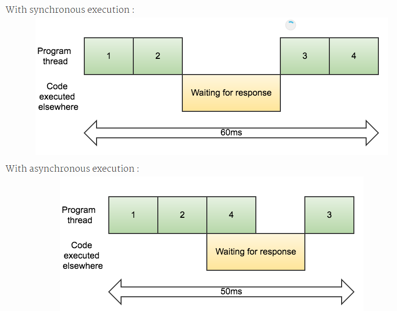

单线程和异步
===================
js是单线程的语言，也就是说，JavaScript 同一时间只能执行一个任务，当前任务执行完毕后，才能执行下一项任务。

###  JS引擎多线程
js是单线程语言，浏览器只分配给js一个主线程，用来执行任务，一次只能执行一个任务，这些任务形成一个任务队列排队等候执行，但某些任务是非常耗时的，比如网络请求，定时器和事件监听，如果排队等待执行的话，执行效率会非常的低，甚至导致页面的假死。所以，JS引擎还提供一个任务队列（task queue），里面是主线程挂起的异步任务。

###  优点
直接通过一个例子对同步和异步进行对比，假设有四个任务（编号为1,2,3,4），它们的执行时间都是10ms,其中任务2是任务3的前置任务，任务2需要20ms的响应时间。

可以看出，当程序需要大量I/O操作和用户请求时，js具备单线程，异步，事件驱动的优势。相比于多线程语言，它不必耗费过多的系统开销，同时也不必把精力用于处理多线程管理，相比于同步执行的语言，宿主环境的异步和事件驱动机制又让它实现了非阻塞I/O。

###  事件循环

所有上下文都在主线程上执行，形成一个执行栈。先执行同步任务，挂起异步任务。微任务可执行时，先放在微队列，宏任务在宏队列。同步任务执行完后，先执行完所有微队列的任务后，再读取宏队列，执行完一个宏任务，就再去执行微队列的任务。
JS引擎循环这个过程的运行机制，就叫做事件循环（Event Loop）。

**宏任务**
ajax，定时器，DOM监听，UI Rendering

**微任务**
Promise的then，await，Mutation Observer，QueueMicrotask()

###  异步操作
**定时器**

    setTimeout(function(){
        console.log("50ms");
    }，50）;

执行这段代码的时候，浏览器异步执行计时操作，当50ms到了后，会触发定时事件，这个时候，就会把回调函数放到任务队列里。

**回调函数**
回调函数是异步操作最基本的方法。
```
function f1(callback) {
  // ...
  let a = '变量'
  callback(a);
}

function f2(param) {
  // param的处理
}

f1(f2);
```

  [1]: /file/view/images%2FHTML--CSS--JS%2FJS%2F%E7%9B%B8%E5%85%B3%E6%96%87%E4%BB%B6%2F20.1.png