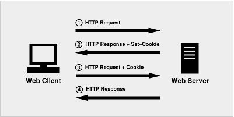

Cookies
===================
Cookie是服务器发送到用户浏览器并保存在本地的一小块数据，记录客户端用户的信息。由服务器在 HTTP 回应的头信息里面，设置（多个）Set-Cookie字段生成，在浏览器下次向同一服务器再发起请求时被携带并发送到服务器上。

通常，在客户端的第二次请求头部中包含Cookie，提供给服务器端可以用来唯一标识客户端身份的信息。它用于告知服务端两个请求是否来自同一浏览器，如保持用户的登录状态。Cookie使无状态的HTTP协议记录稳定的状态信息成为了可能。这些信息以文本文件的方式（名/值对）存放在客户端

    username=John
每次当浏览器从服务器上请求 web 页面时， 属于该页面的 cookies 会被添加到该请求头部发送给服务器。服务端通过这种方式来获取用户的信息。

    GET /sample_page.html HTTP/1.1
    Host: www.example.org
    Cookie: yummy_cookie=choco; tasty_cookie=strawberry

**Cookie内容**
1.Cookie 的名字
2.Cookie 的值（真正的数据写在这里面）
3.到期时间Expires
4.所属域名Domain（默认是当前域名）
5.生效的路径Path（默认是当前网址）

Cookie 对该域名的该路径（包括子路径）有效，浏览器一旦访问这个路径，浏览器就会附上这段 Cookie 发送给服务器。

###基本特点
1.cookie所存放的数据不能超过4kb，如果超过，则将返回空字符串。
2.cookie以文件形式存放在客户端，查看和修改 cookie 都很方便，所以不要存放重要信息。
3.一个cookie的生命周期就是在浏览器关闭的时候结束。如果想要cookie能在浏览器关掉之后还可以使用，就必须要为该cookie设置有效期，也就是cookie的失效日期。
4.cookie有域和路径这个概念。因为浏览器是个注意安全的环境，所以不同的域之间是不能互相访问 cookie的(当然可以通过特殊设置的达到cookie跨域访问)。一个网页所创建的cookie只能被与这个网页在同一目录或子目录下得所有网页访问，而不能被其他目录下得网页访问。

###浏览器处理Cookie
使用 document.cookie 属性来创建 、读取、及删除 cookies。

    document.cookie = 'username=John';
username表示cookie名称，John表示这个名称对应的值。假设cookie名称并不存在，那么就是创建一个新的cookie；如果存在就是修改了这个cookie名称对应的值。
在默认的情况下，cookie会在浏览器关闭的时候自动清除，可以通过expires来设置cookie的有效期

    document.cookie = "username=John;expires=date";
date值为GMT(格林威治时间)格式的日期型字符串。表示cookie过期时间。可以获取当前时间来设置date，：

    var date=new Date();
    date.setHours(date.getHours()+7*24-8);
    //东八区比格林威治时间早8小时
    document.cookie = "username="+encodeURIComponent("中文值")+";expires="+date;
    //所有名字和值都是要经过URL编码的，使用中文需要编码（encodeURIComponent()）解码（decodeURIComponent()）
因此，删除 cookie 只需要设置 expires 参数为以前的时间即可。

    document.cookie = "username=; expires=Thu, 01 Jan 1970 00:00:00 GMT";
删除时不必指定 cookie 的值。