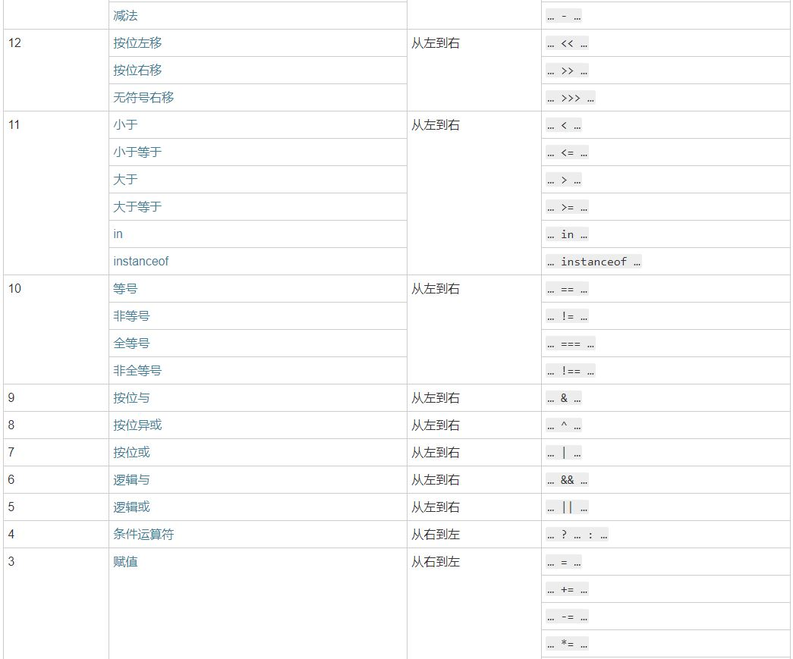
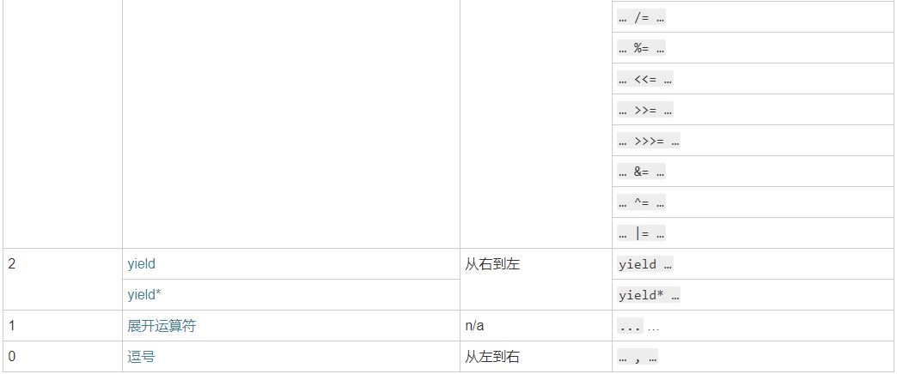

运算符
===================
JavaScript的运算符按运算符类型可以分为以下5种：

（1）算术运算符；
（2）比较运算符；
（3）赋值运算符；
（4）逻辑运算符；
（5）条件运算符；

###算术运算符
**加法运算符**
`+`运算符可以完成两种运算，既可以处理算术的加法，也可以用作字符串连接。

	<script type="text/javascript">
		var a="我要在这里"
		var b="加一个空格"
		var c=" "
		var x=a+c+b
		document.write(x)
	</script>
它的算法步骤如下。

1. 如果运算子是对象，先自动转成原始类型的值（即先执行该对象的valueOf方法，如果结果还不是原始类型的值，再执行toString方法；如果对象是Date实例，则先执行toString方法）。
2. 两个运算子都是原始类型的值以后，只要有一个运算子是字符串，则两个运算子都转为字符串，执行字符串连接运算。
3. 否则，两个运算子都转为数值，执行加法运算。
```
'1' + {foo: 'bar'} // "1[object Object]"
'1' + true // "1true"
true + false // 1
```
因此，使用`+`运算符可以将一个值快速转为字符串
```
123 + ''  // '123'
```
加法运算符一般有左右两个运算子，如果只有右边一个运算子，则返回右边运算子的数值形式
```
+'1' // 1
+true // 1
+[] // 0
+{} // NaN
```

“++”是自增运算符，它指的是在原来值的基础上加1，“-- --”是自减运算符，它指的是在原来值的基础上减1。需要注意，该运算符有两种情况，拿自增运算符举例，“i++”指的是在使用i之后，再将i的值加1，而“++i”指的是先将i的值加1，再使用i。

    i=1;
    j=i++;   //i=2,j=1

    i=1;
    j=++i;  //i=2,j=2

###比较运算符
首先对操作数进行比较，该操作数可以是数字也可以是字符串，然后返回一个布尔值true或false。
字符串只比较首个数字的大小。
比较特别的包括：

| 运算符   |  效果   |
| :----:  | :----: |
| == | 相等 |
| === | 相同（值和类型） |
| != | 不相等 |
|  !== | 不相同（值和类型） |

`==`会进行隐式的类型转换，再判断数值是否相等。
`===`先判断类型再比较值，类型不同直接不相等。
两个引用类型（对象、数组、函数）数据比较时，不是比较它们的值是否相等，而是比较它们是否指向同一个内存地址。

###赋值运算符
| 运算符   |  效果   |
|:----: | :----: |
|   =      |  a=b   |
|  +=	  |a+=b等价于a=a+b  |
|-=	  |a--=b等价于a=a-b  |
|*=  |	a*=b等价于a=a*b  |
|/=  |a/=b等价于a=a/b  |
|%=  |a%=b等价于a=a%b   |   
%表示取余。

###逻辑运算符
逻辑运算符简单来说就是与，或，非。通常用于执行布尔运算，与，或位于两个表达式之间，返回布尔值true或false。
| 运算符   |  效果   |
| :----:  | :----: |
| && | 逻辑与，若两边表达式的值都为true，则返回true；任意一个值为false，则返回false |
| &#124;&#124;  | 逻辑或，只有表达式的值都为false，才返回false，其他情况返回true  |
| ！  | 逻辑非，若表达式的值为true，则返回false；若表达式的值为false，则返回true  |
逻辑与如果确定左边为false，则会跳过右边，不再计算右边结果。

###条件运算符
语法为（条件）? "表达式1" : "表达式2";
如果“条件”为true，则表达式的值使用“表达式1”的值；如果“条件”为false，则表达式的值使用“表达式2”的值。

	<script type="text/javascript">
		var a=3
		var b=5
		var c=(a<b)?"正确":"错误"
		document.write(c)
	</script>

###优先级


