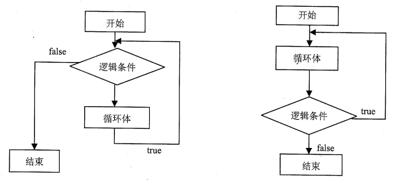

控制流程
===================
对程序流程主要有以下3种：

 1. 顺序结构
 2. 选择结构
 3. 循环结构

###顺序结构
按照从上到下、从左到右的顺序执行。

**throw语句**
throw语句用来抛出一个用户自定义的异常。当前函数的执行将被停止（throw之后的语句将不会执行）。
```
function getRectArea(width, height) {
  if (isNaN(width) || isNaN(height)) {
    throw "Parameter is not a number!";
  }
  window.reload();
}

try {
  getRectArea(3, 'A');
}
catch(e) {
  console.error(e);
  // expected output: "Parameter is not a number!"
}
```

###选择结构
照给定的逻辑条件来决定执行的顺序，有单向选择、双向选择和多向选择之分，但是程序在执行过程中都只是执行其中的一条分支。

###循环结构
循环结构即根据代码的逻辑条件来判断是否重复执行某一段程序。


