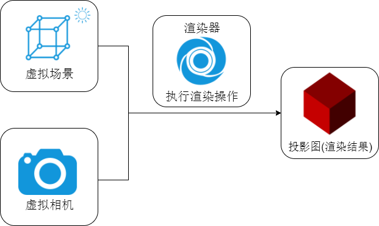

了解threejs
===================
###  说明
three.js就是使用javascript来构建3D场景，在github开源。
three压缩包的内容：
```
three.js-master
└───build——src目录下各个代码模块打包后的结果
    │───three.js——开发的时候.html文件中要引入的threejs引擎库

└───docs——Three.js API文档文件
    │───index.html——打开该文件可以实现离线查看threejs API文档

└───editor——Three.js的可视化编辑器，可以编辑3D场景
    │───index.html——打开应用程序

└───examples——里面有大量的threejs案例

└───src——Three.js引擎的各个模块，可以通过阅读源码深度理解threejs引擎
    │───index.html——打开该文件可以实现离线查看threejs API文档

└───utils——一些辅助工具
    │───\utils\exporters\blender——blender导出threejs文件的插件
```
###  核心
WebGL 的渲染是需要 HTML5 Canvas 元素的，所以需要在 <body> 部分中定义Canvas 元素，或者使用 js 生成。
一个典型的 Three.js 程序至少要包括**渲染器（Renderer）、场景（Scene）、照相机（Camera）**，以及在场景中创建的**物体**。

**渲染器Renderer**
渲染器用于渲染场景。
渲染器将和 Canvas 元素进行绑定，如果在 HTML 已经创建了 Canvas 元素，那么 Renderer 可以这样写：

    var renderer = new THREE.WebGLRenderer({
        canvas: document.getElementById('#mainCanvas')
    });
    renderer.setSize(window.innerWidth, window.innerHeight);    // 设置渲染器的大小为全屏
也可以自动创建 Canvas 元素，在JavaScript 代码中可以这样写：

    var renderer = new THREE.WebGLRenderer();
    renderer.setSize(window.innerWidth, window.innerHeight);    // 设置渲染器的大小为全屏
    document.querySelector('body').appendChild(renderer.domElement);

**场景Scene**
在 Three.js 中的一切物体都需要放置在场景内。
在程序最开始的时候进行实例化。

    var scene = new THREE.Scene();
所有的物体都需要添加到场景中，也就是说，场景是所有物体的全局对象，通过

    scene.children

可以访问到这些子物体。这些物体在创建的时候是没有名字的，可以通过name属性指定名字，这样就可以通过

    scene.getChildByName(name)

来访问具体的子物体。

    scene.traverse(function)

可以遍历该父场景中的所有子物体来执行回调函数。

**相机Camera**
WebGL 和 Three.js 使用的坐标系是右手坐标系，即右手伸开，拇指为X，四指为Y，手心为Z。

相机就是场景的观察者，我们的视角就是相机的视角，相机就是我们的眼睛。在Threejs中有多种相机，透视相机（THREE.PerspectiveCamera）用的最多。
定义透视投影的照相机:

    var camera = new THREE.PerspectiveCamera(45, 4 / 3, 1, 1000);
    camera.position.set(0, 0, 5);
    scene.add(camera);

注意，**一切物体都需要被添加到场景中**，包括相机。

**总结**
相机的作用就是指向场景，在场景中取景，把它拍下来。渲染器将相机拍摄下来的图片，放到浏览器中显示给我们看。
在定义了场景中的物体，设置好的照相机之后，只需要调用渲染器的渲染函数，就能进行一次渲染了。

    renderer.render(scene, camera);

