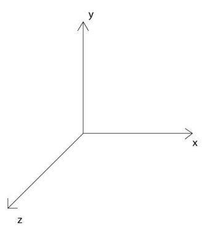

了解threejs
===================
###说明
three.js就是使用javascript 来写3D程序。
在浏览器端，WebGL 是一个底层的标准，在这些标准被定义之后，Chrome、Firefox之类的浏览器实现了这些标准。然后，就能通过 JavaScript 代码，在网页上实现三维图形的渲染了。ThreeJS则是封装了底层的图形接口，更容易来实现3D程序。

###核心
WebGL 的渲染是需要 HTML5 Canvas 元素的，所以需要在 <body> 部分中定义Canvas 元素，或者使用 js 生成。
一个典型的 Three.js 程序至少要包括**渲染器（Renderer）、场景（Scene）、照相机（Camera）**，以及你在场景中创建的物体。

**渲染器**
渲染器将和 Canvas 元素进行绑定，如果在 HTML 中手动定义了Canvas 元素，那么 Renderer 可以这样写：

    var renderer = new THREE.WebGLRenderer({
        canvas: document.getElementById('#mainCanvas')
    });
如果想要 Three.js 生成 Canvas 元素，在 HTML 中就不需要定义 Canvas 元素，在JavaScript 代码中可以这样写：

    var renderer = new THREE.WebGLRenderer();
    renderer.setSize(400, 300);    // 设置渲染器的大小为窗口的内宽度，也就是内容区的宽度
    document.getElementsByTagName('body')[0].appendChild(renderer.domElement);

**场景**
在 Three.js 中添加的物体都是添加到场景中的，因此它相当于一个大容器。在程序最开始的时候进行实例化，然后将物体添加到场景中即可。

    var scene = new THREE.Scene();
也就是说，场景是光源，相机和所有物体的父容器，通过

    scene.children

可以访问到这些子物体。这些物体在创建的时候是没有名字的，可以通过name属性指定名字，这样就可以通过

     scene.getChildByMName(name)

来访问具体的子物体。
通过

    scene.traverse(function)

可以遍历该父场景中的所有子物体来执行回调函数。

**相机**
WebGL 和 Three.js 使用的坐标系是右手坐标系，即右手伸开，拇指为X，四指为Y，手心为Z。

相机就像人的眼睛一样，人站在不同位置，抬头或者低头都能够看到不同的景色。在Threejs中有多种相机，透视相机（THREE.PerspectiveCamera）用的最多。定义透视投影的照相机:

    var camera = new THREE.PerspectiveCamera(45, 4 / 3, 1, 1000);
    camera.position.set(0, 0, 5);
    scene.add(camera);

注意，**照相机也需要被添加到场景中**。

**总结**
Three.js中的场景是一个物体的容器，开发者将需要的物体放入场景中。
相机的作用就是指向场景，在场景中取一个合适的景，把它拍下来。
渲染器的作用就是将相机拍摄下来的图片，放到浏览器中去显示。
在定义了场景中的物体，设置好的照相机之后，渲染器就知道如何渲染出二维的结果了。这时候，只需要调用渲染器的渲染函数，就能使其渲染一次了。

    renderer.render(scene, camera);
