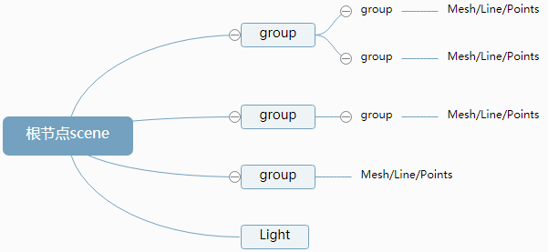

层级结构
---
通过Threejs的组对象Group可以组织各个模型，构成一个层级结构。使各物体对象在语法上的结构更加清晰。

###  Group

通过THREE.Group类创建一个组对象group,然后通过add方法把网格模型mesh1、mesh2设置为组对象group的子对象:

    var group = new THREE.Group();
    group.add(mesh1);
    group.add(mesh2);
    scene.add(group);
父对象group进行旋转、缩放、平移变换，子对象同样跟着变换。

场景对象scene构成的层级模型第一层，也就是树结构的根节点。层级模型的中间层一般都是通过Group类的实例化group来完成，group层级内再包含mesh，这样结构非常清晰。

