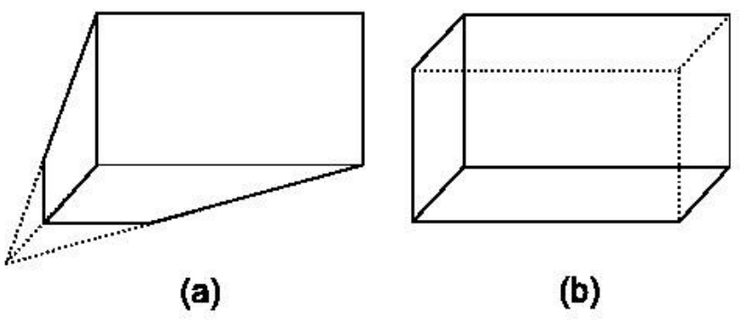
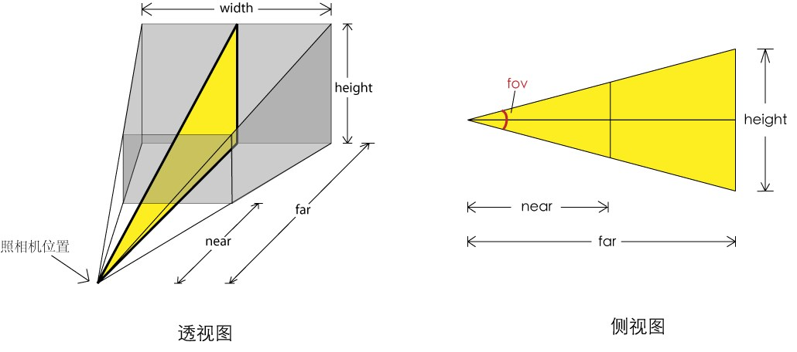

照相机
===================
根据投影方式的不同，照相机又分为正交投影照相机与透视投影照相机。使用透视投影照相机获得的结果是类似人眼看到的有“近大远小”的效果；而使用正交投影照相机获得的结果就像平面画3D的效果，在三维空间内平行的线，投影到二维空间中也一定是平行的。

###正交投影照相机
正交投影照相机的构造函数是：

    THREE.OrthographicCamera(left, right, top, bottom, near, far)
这六个参数分别代表正交投影照相机拍摄到的空间的六个面的位置，其为视景体（Frustum）。只有在视景体内部的物体才可能显示在屏幕上，而视景体外的物体会在显示之前被裁减掉。
为了保持照相机的横竖比例，需要保证 (right - left) 与 (top - bottom) 的比例与 Canvas宽度与高度的比例一致。

    var camera = new THREE.OrthographicCamera(-2, 2, 1.5, -1.5, 1, 100);
    camera.position.set(0, 0, 5);
    scene.add(camera);
其中，第二句是设定照相机的位置。照相机默认都是沿 z 轴负方向观察的，可以通过 lookAt 函数指定它看着其他方向：

    camera.lookAt(new THREE.Vector3(0, 0, 0));
这样就改变照相机观察方向由当前位置指向原点。注意， lookAt 函数接受的是一个 THREE.Vector3 的实例。

###透视投影相机
透视投影是更符合人眼视觉的投影，构造函数是：

    PerspectiveCamera( fov, aspect, near, far )

fov：为视角的大小,如果设置为0,相当你闭上眼睛了,所以什么也看不到,如果为180,那么可以认为你的视界很广阔,但是在180度的时候，往往物体很小，因为他在你的整个可视区域中的比例变小了。
aspect：为实际窗口的纵横比，即宽度除以高度。通常设为Canvas 的横纵比例。

    var camera = new THREE.PerspectiveCamera(45, 400 / 300, 1, 100);
    camera.position.set(0, 0, 5);
    scene.add(camera);