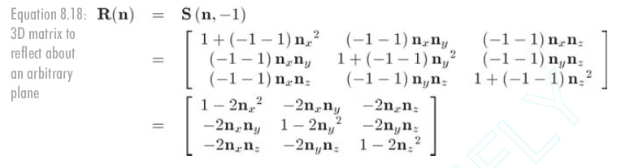

基础库
===

###  颜色

构造器（Constructor）

    Color( r , g , b )
.r : Float
红色通道的值在0到1之间。默认值为1。
.g : Float
绿色通道的值在0到1之间。默认值为1。
.b : Float
蓝色通道的值在0到1之间。默认值为1。

    var color = new THREE.Color( 1, 0, 0 );

使用**十六进制**定义一个颜色在three.js中是标准的方法

    var color = new THREE.Color( 0xff0000 );

###  欧拉角
欧拉角描述一个旋转变换，通过指定轴顺序和指定各轴旋转角度来旋转一个物体。
构造器（Constructor）

    Euler( x : Float, y : Float, z : Float, order : String )

x - (optional) 用弧度表示x轴旋转量。 默认值是 0。
y - (optional) 用弧度表示y轴旋转量。 默认值是 0。
z - (optional) 用弧度表示z轴旋转量。 默认值是 0。
order - (optional) 表示旋转顺序的字符串，默认为'XYZ'（**必须是大写**）。

    var a = new THREE.Euler( 0, 1, 1.57, 'XYZ' );
    var b = new THREE.Vector3( 1, 0, 1 );
    b.applyEuler(a);

###  三维几何线段
构造器（Constructor）

    Line3( start : Vector3, end : Vector3 )

start - 线段的起始点。默认值为 (0, 0, 0)。
end - 线段的终点。默认值为 (0, 0, 0)。

###  二维向量
表示2D vector（二维向量），是一对有顺序的数字（标记为x和y）。
```
Vector2( x : Float, y : Float )
```
x - 向量的x值，默认为0。
y - 向量的y值，默认为0。


###  三维向量
表示的是一个三维向量，是一个有顺序的、三个为一组的数字组合（标记为x、y和z）。
构造函数

    Vector3( x : Float, y : Float, z : Float )

x - 向量的x值，默认为0。
y - 向量的y值，默认为0。
z - 向量的z值，默认为0。


###  四维矩阵
在3D计算机图形学中，4x4矩阵最常用的用法是作为一个变换矩阵。三维空间中的向量Vector3通过乘以矩阵来进行转换，如平移、旋转、剪切、缩放、反射、正交或透视投影等。
构造器（Constructor）

    Matrix4()

###  无限平面
在三维空间中无限延伸的二维平面
构造器（Constructor）

    Plane( normal : Vector3, constant : Float )

normal - (可选参数) 定义单位长度的平面法向量Vector3。默认值为 (1, 0, 0)。
constant - (可选参数) 从原点到平面的有符号距离。 默认值为 0.

###  射线
构造函数

    Ray( origin : Vector3, direction : Vector3 )

origin - （可选）Ray（射线）的原点，默认值是一个位于(0, 0, 0)的Vector3。
direction - Vector3 Ray（射线）的方向。该向量必须经过标准化（使用Vector3.normalize），这样才能使方法正常运行。 默认值是一个位于(0, 0, 0)的Vector3。


----------
###  镜像
在三维世界中，物体是经过某平面呈镜像的。同样的，设向量n是任意某平面的法线的单位向量，不考虑平移，其变换矩阵：


    var m = new THREE.Matrix4();
    var vec=new THREE.Vector3(0,0,1);
    m.set( 1-2*vec.x*vec.x, -2*vec.x*vec.y, -2*vec.x*vec.z, 0,
    -2*vec.x*vec.y, 1-2*vec.y*vec.y, -2*vec.y*vec.z, 0,
    -2*vec.x*vec.z, -2*vec.y*vec.z, 1-2*vec.z*vec.z, 0,
    0, 0, 0, 1 );
    mesh.applyMatrix(m);
    mesh.translateZ(300);          
