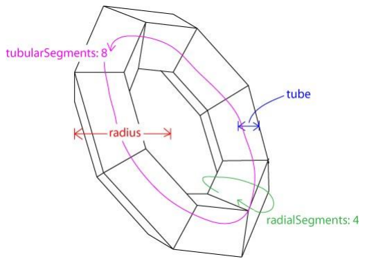

形状
===
threejs封装了一些常见的几何形状。

###  面
**平面**

    THREE.PlaneGeometry(width, height, widthSegments, heightSegments)
 width 是 x 方向上的长度； height 是 y 方向上的长度；后两个参数同样表示分段。

**圆形**

    THREE.CircleGeometry(radius, segments, thetaStart, thetaLength)
这四个参数和球体中的是类似的。

###  体
**立方体**

    THREE.CubeGeometry(width, height, depth, widthSegments, heightSegments, depthSegments)
这里， `width` 是 x 方向上的长度； `height` 是 y 方向上的长度； `depth` 是 z 方向上的长度；后三个参数分别是在三个方向上的分段数，如 widthSegments 为 3 的话，代表 x 方向上水平分为三份。一般情况下不需要分段的话，可以不设置后三个参数，后三个参数的默认值为 1 。
如： `new THREE.CubeGeometry(1, 2, 3);` 可以创建一个 x 方向长度为 1 ，y 方向长度为 2 ，z 方向长度为 3 的立方体。

物体的几何中心默认在原点的位置。若设置了分段，会对六个面进行分段，而不是对立方体分段，因此在立方体的中间是不分段的，只有六个侧面被分段。

**柱体**

    THREE.CylinderGeometry(radiusTop, radiusBottom, height, radiusSegments, heightSegments, openEnded)
其中， radiusTop 与 radiusBottom 分别是顶面和底面的半径，由此可知，当这两个参数设置为不同的值时，实际上创建的是一个圆台； height 是圆柱体的高度；radiusSegments 与 heightSegments 可类比球体中的分段； openEnded 是一个布尔值，表示是否没有顶面和底面，默认为 false ，表示有顶面和底面。

**圆环**

    THREE.TorusGeometry(radius, tube, radialSegments, tubularSegments, arc)
其中， radius 是圆环半径； tube 是管道半径； radialSegments 与 tubularSegments 分
别是两个分段数，详见上图； arc 是圆环面的弧度，默认为 Math.PI * 2 。

**球体**

    THREE.SphereGeometry(radius, segmentsWidth, segmentsHeight, phiStart, phiLength, thetaStart, thetaLength)
其中， `radius` 是半径； `segmentsWidth` 表示经度上的切片数； `segmentsHeight` 表示纬度上的切片数； `phiStart` 表示经度开始的弧度； `phiLength` 表示经度跨过的弧度；`thetaStart` 表示纬度开始的弧度； `thetaLength` 表示纬度跨过的弧度。
使用 `var sphere = new THREE.SphereGeometry(3, 8, 6)` 可以创建一个半径为 3，经度划分成 8 份，纬度划分成 6份的球体，如下图所示：

segmentsWidth 相当于经度被切成了几瓣，而 segmentsHeight 相当于纬度被切成了几层。对于球
体而言，当这两个值较大的时候，形成的多面体就可以近似看做是球体了。

###  自定义几何体
`BufferGeometry`是面片、线或点几何体的有效表述。包括顶点位置，面片索引、法相量、颜色值、UV 坐标和自定义缓存属性值。读取或编辑 BufferGeometry 中的数据，需要 BufferAttribute 。
`Geometry` 是一个便于使用的 BufferGeometry 的替代品。Geometry 利用 Vector3 或 Color 存储了几何体的相关 attributes（如顶点位置，面信息，颜色等）比起 BufferGeometry 更容易读写，但是运行效率不如有类型的队列。

    Geometry.vertices : Array
顶点的队列，保存了模型中每个顶点的位置信息。

    Vector3( x : Float, y : Float, z : Float )
    x - 向量的x值，默认为0。
    y - 向量的y值，默认为0。
    z - 向量的z值，默认为0。
---
    Geometry.faces : Array
描述每个顶点之间如何组成模型面的面队列。同时该队列保存面和顶点的法向量和颜色信息。

    Face3( a : Integer, b : Integer, c : Integer, normal : Vector3, color : Color, materialIndex : Integer )
    a — 顶点 A 的索引。
    b — 顶点 B 的索引。
    c — 顶点 C 的索引。