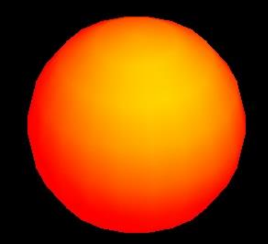
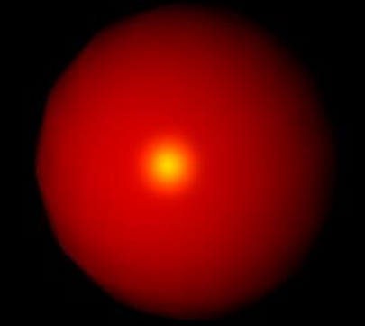

材质
===
材质（Material）是与渲染效果相关的属性。通过设置材质可以改变物体的颜色、纹理贴图、光照模式等。材质的共有属性包括：
**通用属性**
1. id：用来标识材质。
2. name：赋予材质名称。
3. opacity：定义物体透明度，取值范围0~1
4. side：设定在几何体的哪个面应用材质，默认值为THREE.FrontSide，即外面。也可以设置为THREE.BackSide（内面）或THREE.DoubleSide（双面）。

###  基本材质
用基本材质（BasicMaterial）的物体渲染后的颜色始终为该材质的颜色，不会由于光照产生明暗、阴影效果。如果没有指定材质的颜色，则颜色是随机的。

    THREE.MeshBasicMaterial(opt)
其中， opt 为包含各属性的值的对象。如新建一个不透明度为 0.75 的黄色材质：

    new THREE.MeshBasicMaterial({
        color: 0xffff00,
        opacity: 0.75
    });
常用的属性包括：
1. visible ：是否可见，默认为 true
2. side ：渲染面片正面或是反面，默认为正面 `THREE.FrontSide` ，可设置为反面`THREE.BackSide` ，或双面 `THREE.DoubleSide`
3. wireframe ：是否渲染线而非面，默认为 false
4. color ：十六进制 RGB 颜色，如红色表示为 0xff0000
5. map ：使用纹理贴图

###  Lambert 材质
Lambert 光照模型的主要特点是只考虑漫反射而不考虑镜面反射的效果，因而对于金属、镜子等需要镜面反射效果的物体就不适应，对于其他大部分物体的漫反射效果都是适用的。

    new THREE.MeshLambertMaterial(opt)
`color` 是用来表现材质对散射光的反射能力，也是最常用来设置材质颜色的属性。除此之外，还可以用 ambient 和 emissive 控制材质的颜色。
`ambient` 表示对环境光的反射能力，只有当设置了 AmbientLight 后，该值才是有效的，材质对环境光的反射能力与环境光强相乘后得到材质实际表现的颜色。
`emissive` 是材质的自发光颜色，可以用来表现光源的颜色。
如果同时使用红色的自发光与黄色的散射光：

    new THREE.MeshLambertMaterial({
        color: 0xffff00,
        emissive: 0xff0000
    })

###  Phong 材质
Phong 模型考虑了镜面反射的效果，因此对于金属、镜面的表现尤为适合。

    new THREE.MeshPhongMaterial(opt);
可以通过 shininess 属性控制光照模型中的 n 值，当 shininess 值越大时，高光的光斑越小，默认值为 30 。
使用黄色的镜面光，红色的散射光：

    material = new THREE.MeshPhongMaterial({
        color: 0xff0000,
        specular: 0xffff00,
        shininess: 100
    });

###  Depth材质
这种材质的特点在于，不控制物体的渲染效果，外观根据物体到相机的距离变化。一般与其他材质结合形成远处逐渐消失的效果。

**联合材质**

    var depthMaterial=new new THREE.MeshDepthMaterial;
    var basicMaterial=new new THREE.MeshBasicMaterial(opt);
    var cube=new THREE.SceneUtils.createMaterialObject(cubeGeometry,[depthMaterial,basicMaterial]);
    cube.children[1].scale.set(0.99,0.99,0.99);
对于要进行融合的材质，需要添加属性`transparent:true`开启融合模式。
`createMaterialObject()`创建网格时，几何体·会被复制，返回一个网格组，内部的网格完全一样。渲染时画面会闪烁。所以需要最后一行代码来缩小带有depth材质的网格，避免出现闪烁。
