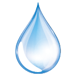

模型
===

使用几何形状和材质就能创建物体模型了。最常用的一种物体就是网格（Mesh），网格是由顶点、边、面等组成的物体；其他物体模型包括线段（Line）、骨骼（Bone）、粒子系统（ParticleSystem）等。

###网格模型
创建物体需要指定几何形状和材质，其中，几何形状决定了物体的顶点位置等信息，材质决定了物体的颜色、纹理等信息。


    Mesh(geometry, material)

创建网格要把几何形状与材质传入其构造函数。

    var material = new THREE.MeshLambertMaterial({
        color: 0xffff00
    });
    var geometry = new THREE.CubeGeometry(1, 2, 3);
    var mesh = new THREE.Mesh(geometry, material);
    scene.add(mesh);
若不设置属性material ，则每次会随机分配一种 wireframe 为 true 的材质，每次刷新页面后的颜色是不同的。除了在构造函数中指定材质，在网格被创建后，也能对材质进行修改。

    mesh.material = new THREE.MeshLambertMaterial({
        color: 0xff0000
    });

###几何变换
平移、缩放、旋转是物体三个常用属性。即为  `translate` 、`scale` 、 `rotate` 三个属性。

**平移**


    mesh.translateX(100);//沿着x轴正方向平移距离100

沿着向量(0,1,0)方向平移

    var axis = new THREE.Vector3(0,1,0);//向量axis
    mesh.translateOnAxis(axis,100);//沿着向量axis方向平移100

**旋转**

    mesh.rotateX(Math.PI/4);//绕x轴旋转π/4

绕(0,1,0)向量轴旋转π/8

    var axis = new THREE.Vector3(0,1,0);//向量axis
    mesh.rotateOnAxis(axis,Math.PI/8);//绕axis向量轴旋转π/8
**缩放**

    mesh.scale.x = 2.0;//x轴方向放大2倍

    mesh.scale.set(0.5,0.5,0.5);//缩小为原来0.5倍

**克隆**

    cloneMesh = mesh.clone()
网格模型的克隆是浅拷贝，网格模型的几何体和材质对象是共享的，位置信息则是独立的。因此，网格和克隆分别移动，共同缩放。

###粒子系统
粒子系统由精灵模型（Sprite）组成，精灵模型对象和网格模型一样需要设置材质，不过精灵模型不需要设置几何体，它是一个总是面朝着摄像机的平面。
粒子系统一般用来展示下雨，下雪效果。基本思路就是通过足够多的精灵模型组成一个粒子系统，然后每一个雨滴按照在一定空间内随机分布。每个精灵模型都使用一个背景透明的雨滴图片作为纹理贴图。

```
var spriteMap = new THREE.TextureLoader().load( "rain.png" );
var spriteMaterial = new THREE.SpriteMaterial( { map: spriteMap, color: 0xffffff } );
var sprite = new THREE.Sprite( spriteMaterial );
```
把所有创建的精灵模型插入到一个组对象Group中，然后在渲染函数render()中改变每个雨滴精灵模型的y坐标，实现下雨效果。