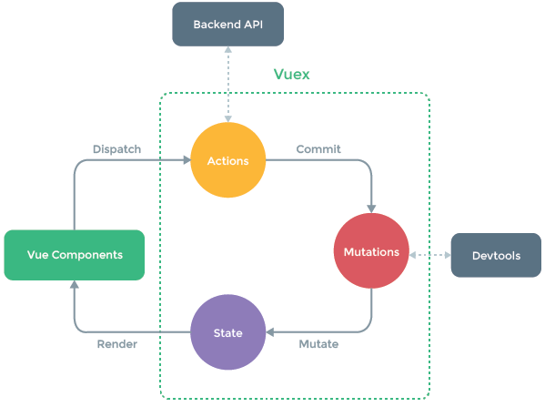

对象核心
===================
store对象有以下几个核心内容：
**state**、**getters**、**mutations**、**actions**、**modules**

###  state
state作为“唯一数据源 (SSOT)”而存在，响应式的存储状态。
在 Vue 组件中读取状态最简单的方法就是在计算属性中返回某个状态：
```
computed: {
    count () {
      return this.$store.state.data
    }
  }
```

###  mutations
Vuex 中的 mutations 类似于方法，内部注册的函数就是实际进行状态更改的地方，函数默认接受 state 作为第一个参数：
```
mutations: {
    increment (state) {
      // 变更状态
      state.data++
    }
  }
```
在 Vue 组件中变更状态时，如果直接创建方法进行更新，则状态的变更无法被追踪，后期的调试会很麻烦，所以就需要将方法注册在vuex内，在组件中调用该方法：
```
this.$store.commit('increment')
```
mutations还可以接受额外的参数：
```
mutations: {
    addNum(state, num) {
        state.data += num
    }
}
```
这样，在组件访问时：
```
this.$store.commit('increment', 5)
```
###  getters
Vuex 中的 getters 类似于计算属性，返回值会根据它的依赖被缓存起来，且只有当它的依赖值发生了改变才会被重新计算。组件中访问getters的方法类似于state，getters的函数同样默认接受 state 作为第一个参数，还可以接受getters自身作为第二个参数。getters只接受这两个参数。
```
  getters:{
	squrt(state){
		return state.data*state.data
	}  
  }
```
如果想要使用新的参数，可以这样：
```
getters:{
    squrt(state){
        return function(num){
            return state.data*num
        } 
    }  
}
```
在vue组建内访问时：
```
computed: {
    count () {
      return this.$store.getters.squrt(5)
    }
  }
```

###  actions
mutations用于放置同步方法，actions用于放置和提交mutations内注册的mutation进行异步操作，而不是直接变更状态。
actions内的函数接受一个 context 对象，这个对象与 store 实例相同，所以可以通过`context.state`和`context.getters`来获取 state 和 getters。
例如将mutations内addNum进行异步：
```
actions: {
    asyaddNum(content){
        setTimeout(()=>{content.commit('addNum',20)},1000)
    }
}
```
组件内：
```
asyaddNum(){
    this.$store.dispatch('asyaddNum')
}
```
mutation可以接受其他参数。如果需要确认异步完成，就需要给异步添加一个回调函数：
```
//传递一个对象为参数
asyaddNum(content,obj){
    setTimeout(()=>{
        content.commit('addNum',10);
        // 传递的数据
        console.log(obj.data);
        // 回调函数
        obj.success()
    },500)
}
```
```
//组建内引入
asyaddNum(){
    this.$store.dispatch('asyaddNum',{
        data:"传递的数据",
        success(){
            console.log(this.data)
        }
    })
}
```
或者，直接使用promise：
```
asyaddNum(content){
    return new Promise((resolve,reject)=>{
        setTimeout(()=>{
            content.commit('addNum',10);
            resolve(content.state.data)
        },500)
    })
}
```
组件内store.dispatch 可以处理被触发的 action 的处理函数返回的 Promise，并且 store.dispatch 仍旧返回 Promise：
```
asyaddNum(){
    this.$store.dispatch('asyaddNum')
    .then((data)=>{console.log(data)})
}
```

###  modules
应用的所有状态会集中到一个比较大的对象。当应用变得非常复杂时，store 对象就有可能变得相当臃肿。为了解决以上问题，Vuex 允许我们将 store 分割成模块（module）。
```
const moduleA = {
  state: { ... },
  mutations: { ... },
  actions: { ... },
  getters: { ... }
}

const moduleB = {
  state: { ... },
  mutations: { ... },
  actions: { ... }
}

const store = new Vuex.Store({
  modules: {
    a: moduleA,
    b: moduleB
  }
})
```