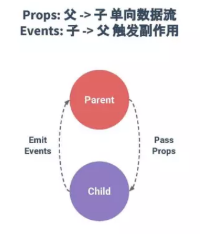

组件
===================
###  父组件与子组件
组件之间可以有嵌套关系，外部组件称为父组件，内部组件称为子组件，父组件内需要`components`对子组件进行注册：

    let child={
        template:'<div>子组件</div>'
    };
    let parent={
        template:'<div><div>父组件</div><child></child></div>',
        components:{
            'child':child
        }
    };

    //全局注册父组件
    vue.component('parent-comp',parent);
这里，子组件是父组件的局部注册组件，只能在父组件内使用，如果需要单独使用子组件，还需要另外全局注册子组件。
###  父组件传值-props
子组件的props注册的内容会成为组件实例的**自定义属性**，通过绑定父组件的数据，就能把数据能传递到子组件使用。

注意：**props内的值是属性，只能是小写**。

子组件构造器内添加props属性：
```
Vue.component('child-comp', {
  props: ['postdata'],
  template: '<h3>{{postdata}}</h3>'
})
```
此时，postdata是子组件的属性，子组件具有父组件实例的作用域，可以获取父组件实例的数据：
```
<child-comp :postdata="父组件的数据"></child-comp>
```
父组件的数据会储存在postdata内，给子组件的模版使用:
```
template: '<h3>{{ postdata }}</h3>'
```
例如父组件的数据是一个数组：
```
<div id="app" v-cloak>
    <parent-comp></parent-comp>
</div>


let childOptions = {
    template:`
        <div>
            // 第三步：使用获取到的值
            <h2 v-for='item in postdata' :key='item.title'>{{item.title}}</h2>
        </div>`,
    // 第一步：注册
    props:['postdata']
}

let parentOptions = {
    template:`
        <div> 
            // 第二步：获取父组件值
            <child-comp :postdata='posts'></child-comp>
        </div>`,
    components:{
        'child-comp': childOptions
    },
    data() {
        return {
            posts: [
                {title: '数据1' },
                {title: '数据2' },
                {title: '数据3' }
            ]
        }
    },
}
Vue.component('parent-comp', parentOptions)

new Vue({
    el:'#app'
})
```

一个组件默认可以拥有任意数量的 prop，组件实例中访问这个值，就像访问 data 中的值一样。
**对象写法**
props也可以是一个对象：
```
props:{
    postdata: {
        type: Number,
        default: 100
    }
}
```
要注意，**如果默认值是对象，则必须使用函数返回**：
```
postdata: {
    type: Array,
    default(){
        return [1,2,3]
    }
}
```
如果prop是Boolean类型，不传值时，默认传递true，组件没有该属性，默认传递false。
prop 是从父组件到子组件单向下行绑定的，是**只读数据**。

###  子组件传值-事件
子组件通过`$emit("自定义事件名"[,...数据])`来传递参数：
**注意：自定义事件名只能是小写。**
```
let childOptions = {
    template:`
        <div>
            // 第一步：绑定事件，注册函数
            <h2 @click='senddata'>子组件</h2>
        </div>`,
    props:{
        postdata: Array
    },
    data() {
        return {
            childData: '子组件数据'
        }
    },
    methods: {
        // 第二步： 事件发生，就触发自定义事件postdata，并传参
        senddata(){
            this.$emit('postdata',this.childData)
        }
    },
}
```
子组件触发click事件时，执行senddata函数,函数内通过`$emit`触发父组件的自定义postdata事件，还可以传递数据作为参数，postdata事件调用父组件getdata函数：
```
let parentOptions = {
    template:`
        <div>
            // 第三步：监听自定义事件，触发函数
            <child-comp @postdata='getdata'></child-comp>
            <p>{{childrendData}}</p>
        </div>`,
    components:{
        'child-comp': childOptions
    },
    data() {
        return {
            childrendData: null
        }
    },
    methods: {
        getdata(data){
            this.childrendData = data
        }
    },
}
```




父传子：父组件的值，通过组件元素自定义标签，传递到props到子组件。
子传父：子组件触发事件时，触发父组件监听的自定义事件，子组件的值作为参数传递到父组件。

###  访问父子组件

**`vm.$children和vm.$refs`**
`vm.$children`和`vm.$refs`的不同之处在于，`vm.$children`会直接获取所有的子组件，`vm.$refs`可以用来获取添加ref属性的组件。

    <div id="#app">
        <parent></parent>
        <parent ref="p"></parent>    
    </div>
    
    components:{	
        parent:parent	
    }

    console.log(this.$children)  //[VueComponent, VueComponent]
    console.log(this.$refs.p)    //VueComponent {}

注意：`$children` 并不保证顺序。
相对来说，使用ref来标记组件更合理，这样不会锁死组件之间的关系。

**`vm.$parent`和`vm.$root`** 
`vm.$parent`会获取组件的父组件，`vm.$root`会获取组件的根组件（vm）。

API访问虽然简洁，但是锁死了组件的位置，组件之间耦合程度高。并且不同于prop的只读，父子组件可以互相修改对方的数据，破坏了单项数据流。


###  Provide / Inject
对于多层嵌套，祖先组件有一个 provide 选项来提供数据/方法，后代组件有一个 inject 选项来接收。

```
// 祖先组件
provide() {
    return {
        fatherdata: this.fatherdata
    }
}

//后代组件
inject: ['fatherdata']
```
provide/inject 这样绑定是一次性的，provide的变化并不会反映在 inject。
如果 provide 传递的数据为响应式的，则inject就能响应式变化。
```
// 祖先组件
provide() {
    return {
        fatherdata: Vue.computed(()=>{return this.fatherdata})
    }
}

//后代组件
inject: ['fatherdata']

//后代组件的模版
<p>{{fatherdata}}</p>
```
或者直接传递一个函数：
```
provide() {
    return {
        fatherdata:()=>{return this.fatherdata}
    }
}
```
后代组件中调用函数。

Inject获取到的数据和prop一样是只读的（不能修改变量指向，但是可以修改变量属性值）。

注意：如果传递的数据如果是引用类型，改变这个数据的属性值引起的其他组件的变化，是由于数据为引用类型导致的，不是响应式。

###  动态组件
```
<component :is="componentName"></component>
```
根据传入的componentName组件名，来动态渲染该组件。
keep-alive标签包裹动态组件时，会缓存组件实例的状态，而不是销毁。再次切换到该组件，会恢复到缓存时的状态。

对于有些有使用限制的元素，诸如ul、table等，也需要is属性。
```
<table>
  //table内只能使用tr、td元素，就需要使用is来加载组件
  <tr :is="componentName"></tr>
</table>
```

###  父子组件生命周期
一、加载渲染过程
父beforeCreate->父created->父beforeMount->子beforeCreate->子created->子beforeMount->子mounted->父mounted
二、子组件更新过程
父beforeUpdate->子beforeUpdate->子updated->父updated
三、父组件更新过程
父beforeUpdate->父updated
四、销毁过程
父beforeDestroy->子beforeDestroy->子destroyed->父destroyed