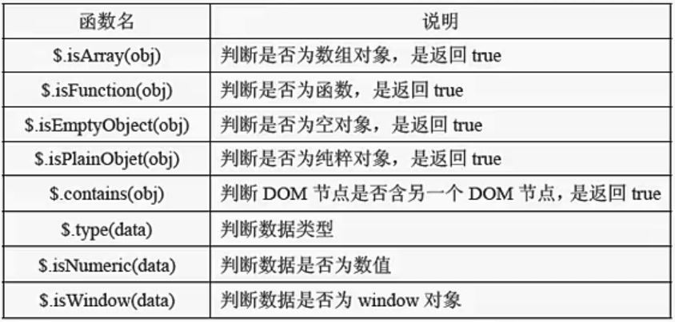

工具函数
===================
工具函数指由jQuery对象本身定义的方法，即全局函数。
一般用于浏览器检测，操作字符串，数组，对象，测试操作，URL操作。

###  数据处理
**遍历**
1.遍历数组

    

2.遍历对象

    $.each( { name: "JavaScript", lang: "JS" }, function(property, value){
        alert( "属性名: " + property + ", 属性值: " + value );
    });

3.对比each()方法：
`$().each()`在dom处理上面用的较多。

    $(selector).each(function(index,element){})
element元素常使用$(this) 选择器来选择。

**数组过滤**

    $.grep(array, function(index,element), [invert])
[invert]为布尔值，默认为false，表示返回符合fn规则的值

**数组变更**

    $.map(array, function(index,element))
将一个数组中的元素转换到另一个数组中。

###  判断类型
