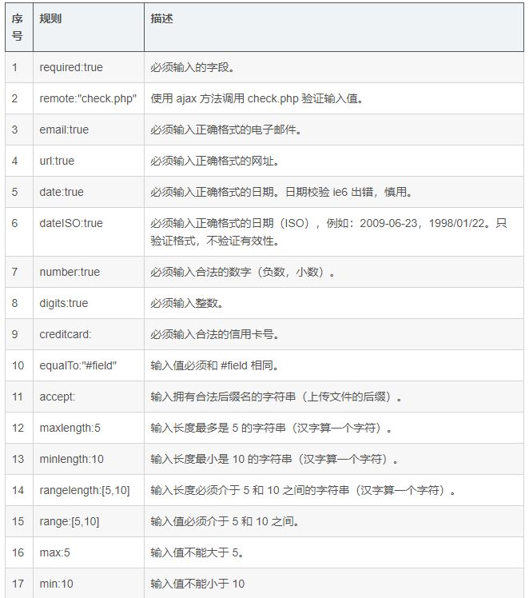

插件
===================

###  表单验证插件validate

表单验证插件validate包括以下功能：
1.自带验证规则
2.验证信息提示
3多种事件触发
4.允许自定义规则验证

**插件使用**
1.导入文件
插件需要位于jQuery之后导入；

    jquery.validate.min.js
    messages_zh.min.js  //本地化信息文件

2.将校验规则写到 js 代码中

     $("选择器").validate({
        rules:{},  //校验规则
        messages:{}  //自定义提示信息,
        errorPlacement:function(error,element){
            error.appendTo(element.next());
        },  //控制错误信息显示的位置
    });
messages处，如果某个控件没有message，将调用默认的信息

    rules:{
		userName:"required",  //字段的name属性:"校验器"
		passWord:{
		required:true,
		digits:true   //字段的name属性:{校验器:值,校验器:值}
		}
	}
默认校验规则：

###  表单插件form
实现ajax方式提交表单数据
form有两个核心方法 -- ajaxForm() 和 ajaxSubmit()， 它们集合了从控制表单元素到决定如何管理提交进程的功能。使用其中一个即可。

**插件使用**
先创建options对象，控制表单提交，再ajax提交，参数设为options：
 
    var options = {  
       url: url,                   //提交地址默认是form的action，如果申明，则会覆盖  
       type: type,                 //提交方式默认是form的method，如果申明，则会覆盖
       target: '#output',          //设置服务器返回数据的放置位置      
       beforeSubmit: function(),   //提交前的回调函数  
       success: function(),        //提交成功后的回调函数  
       dataType: null,             //html(默认), xml, script, json...接受服务端返回的类型  
       clearForm: true,            //成功提交后，清除所有表单元素的值  
       resetForm: true,            //成功提交后，重置所有表单元素的值  
       timeout: 3000               //限制请求的时间，当请求大于3秒后，跳出请求  
    }; 
    $("#form").ajaxForm(options);