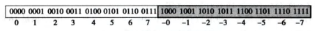
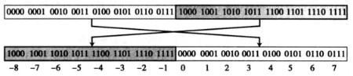
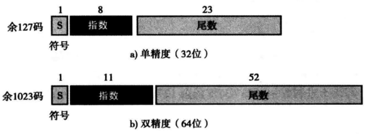

数据结构
===
###计算机内数据

**位(bit/b)**：是存储在计算机的最小单位，值为0或1。
**位模式(位流)**：多个位最组合成一个位模式。
**字节(byte/B)**：长度为8的位模式称1字节。
**字**：字是计算机CPU一次处理的位数，32位机的字长为32位，，64位机的字长为64位。

###整数
整数可以认为是小数点位置固定的数字——小数点固定在最右侧。

####无符号整数表示法
无符号整数（非负数）按照存储单元位数来存储，如果未达到存储位数，则在左侧补0，直到达到位数。
``````
20 => 00010100  8位存储单元
``````
n位存储单元可以存储的非负数整数范围是0~2^n^-1，如果整数超出了存储位数，则会溢出，即只保留存储单元内的值。
``````
20 => 0100  4位存储单元 => 4
``````

####绝对值整数表示法
储存单元的第一个位表示正负（0为正，1为负），其他的位保存整数的绝对值。


``````
0 => 0000  4位存储单元
-0 => 1000  4位存储单元
``````

####补码表示法
储存单元的第一个位表示正负（0为正，1为负），其他的位则不同于绝对值整数表示法。

**反码** 
将每个位反转，即1变为0,0变为1。

补码表示法的负二进制数，首位以外的位，**先反码再加1**，就是实际的负整数。对应负整数求补码，就应该先减1再反码。

###实数
实数包括整数部分和小数部分。

####浮点表示法
**规范化**
浮点表示法会将二进制数小数点移到左侧只有一个非零数码的位置，就像是科学计数法一样。
```
+0101101.1 = +1.011011 * 2^5^
```
浮点数规范化后，需要储存的就变为三个信息：符号(+)、指数(+5)、小数点后的尾数(011011)。

**余码**
在原码的基础上，统一加偏移量来存储。例如4位存储单元可以无符号存储0—15，偏移量为7(2^位数-1^-1，即余7码），也就是可以存储原始值-7—8。**指数使用余码来存储。**

####IEEE标准


以20.5通过32位单精度存储为例：
```
+20.5 = +10100.1 = +1.01001 * 2^4^
符号：+,
尾数：01001,
指数余码：4+127 = 131 = 10000011,
32位单精度存储：0 10000011 010010000000...(一共23位)
```

**JS数值**
JS使用双精度存放浮点数。

**Infinity** : `0 1111111111 0000000000……………………（52个1）`
当指数取最大值2047，尾数都为0。
**NaN**：`0 1111111111 1011…………………… `
当指数取最大值2047，尾数不都为0。
**Number.MAX_VALUE**：`0 1111111110 111111……………………（52个1）`
当指数取值2046，尾数都为1。此时就是js能存储的最大值Number.MAX_VALUE = 1.7976931348623157e+308。
**Number.MIN_VALUE**：`0 0000000000 00000……………………1`
当指数取最小值0，尾数最后一位为1。此时就是js能存储的最小值Number.MIN_VALUE = 5e-324。

###存储音频
音频是连续变化的值，存储时，只能按照时间顺序，保存多个时刻的声音值点。单位时间内，选取的样本量越多，存储的音频越趋向真实。

###存储图像
####位图（光栅图）
图片被分为多个像素块。每个像素块具有红、黄、蓝三原色，每个颜色使用8位来存储（0—255值）。这样，每种颜色都有256个不同的色调，这三种颜色组合在一起，就可以有2^24^中不同颜色。
####矢量图
图片按照内容分解为几何图形的组合，每个几何图形由数据表达。例如，圆可以由圆心坐标、半径、圆的线型和颜色、填充颜色等数据来描述。
根据图片的尺寸和几何图形的数据，就能重新绘制出图片。