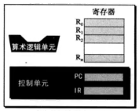
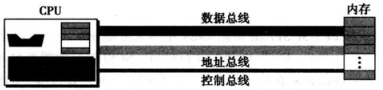

计算机组成
===

###CPU
CPU由算数逻辑单元、寄存器、控制单元组成。

算数逻辑单元对数据进行运算，寄存器存放数据，控制单元控制各系统的交互。

**寄存器**
数据寄存器：存储运算产生的临时数据。
指令存储器(IR)：CPU从内存拿取指令，放置在指令寄存器中，再依次执行。
程序计数器(PC)：存放下一条指令所在单元的地址的地方。

###CPU与内存连接
CPU和内存之间由三组线（数据总线、地址总线、控制总线）连接，这三组线称为总线。

**数据总线**
数据总线里的每根数据线每次传递一个位的数据。
CPU一次能处理多少位，数据总线就有多少根数据线。

**地址总线**
允许CPU访问内存的数据，地址线的数量取决于内存地址的多少。

**控制总线**
在CPU和内存之前传递消息。

###控制器
控制器是I/O设备和CPU内存之间的中介，连接着I/O设备和总线。常见控制器如SSSI、USB和HDMI等。

###程序执行

####机器周期
一个周期包括3步：取指令—>译码—>执行。
**取指令**：CPU控制单元根据PC将指令从内存取出，指令内容存储到IR（指令寄存器），指令地址存储到PC（程序计数器）。指令存储完成后，PC自动增加，指向下一条指令地址。
**译码**：控制单元译码为可执行二进制代码。
**执行**：控制单元发送命令给其他。

在程序开始执行前，它的第一条指令所在的内存单元地址会送入程序计数器。