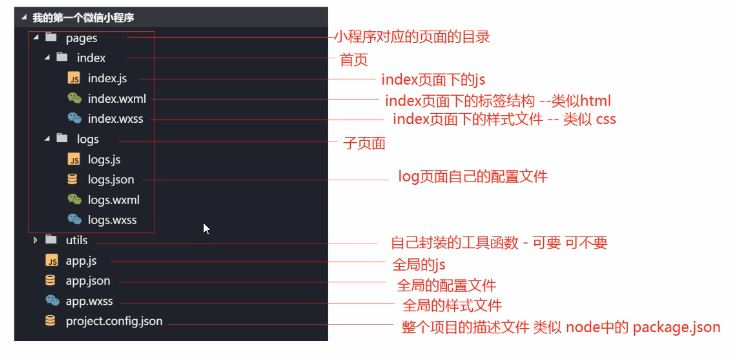

结构
===================

### 文件结构

小程序包括四种不同类型的文件：

**JSON  配置文件**
1.小程序配置 app.json
app.json 是当前小程序的全局配置.。
2.工具配置 project.config.json
开发工具个性化配置
3.页面配置 page.json
当前页面的属性配置

**WXML 模板**
页面结构，类似 HTML，改变了标签名字，采取MVVM模式。

 
**WXSS 样式**
WXSS 具有 CSS 大部分的特性，支持新的尺寸单位 rpx

**JS 逻辑交互**

